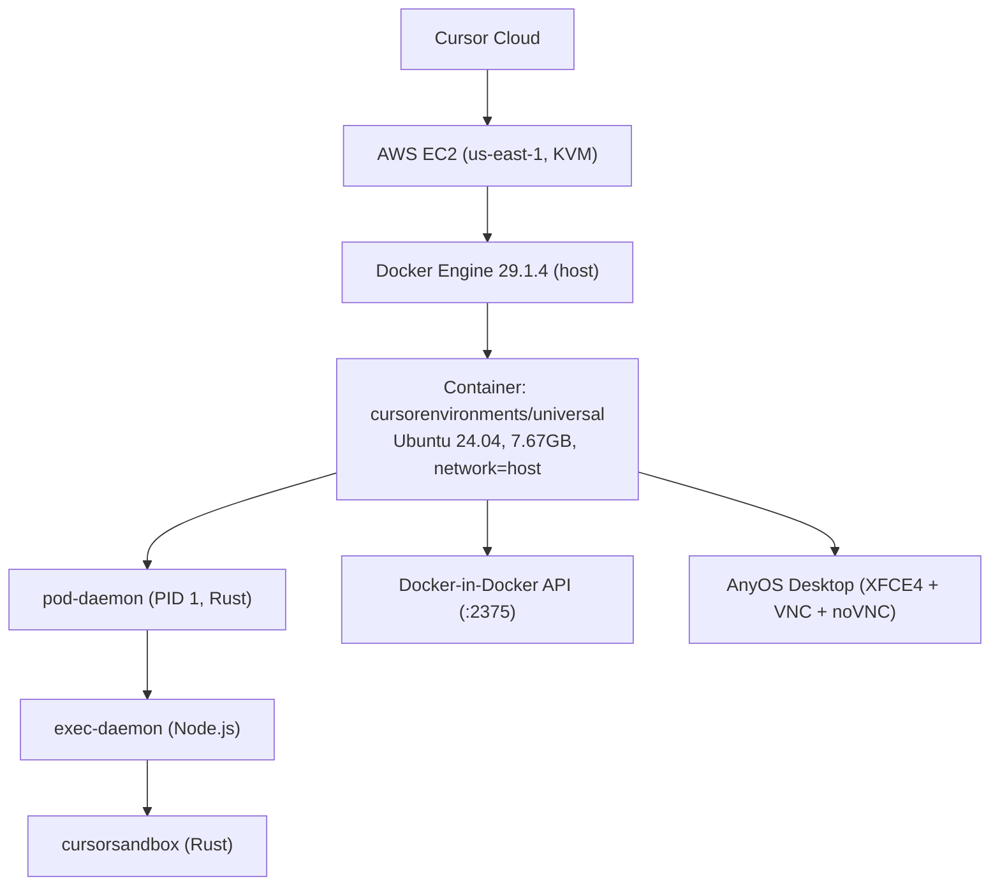
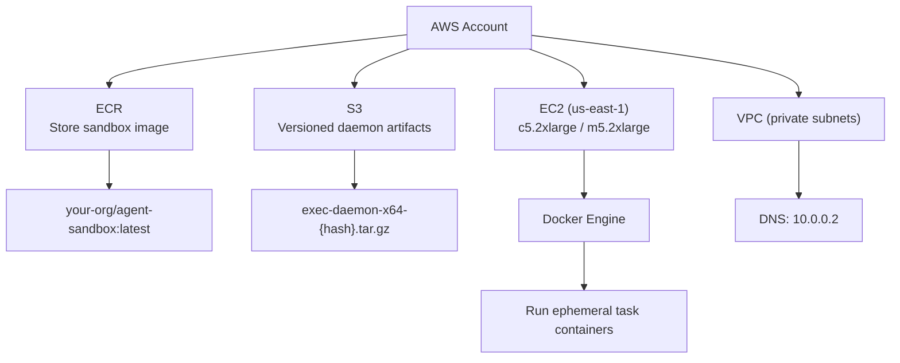
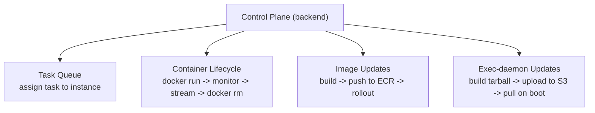
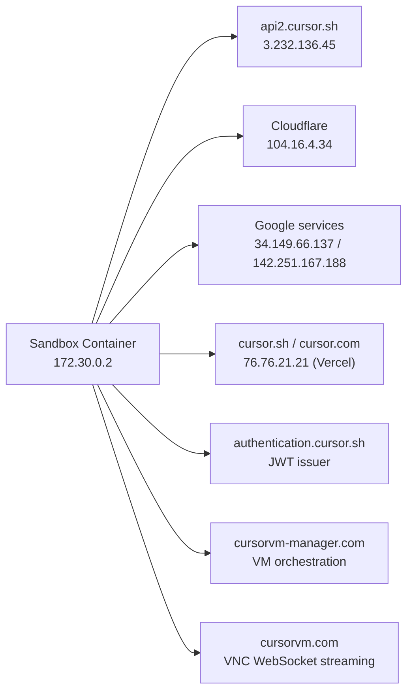

# Cursor Background Agent — Full Architecture Reference

Reverse-engineered from inside a live Cursor Background Agent sandbox (March 2026).

---

## Table of Contents

- [Overview](#overview)
- [Key Findings Snapshot](#key-findings-snapshot)
- [Infrastructure Layers](#infrastructure-layers)
- [Component Details](#component-details)
  - [Pod Daemon](#1-pod-daemon)
  - [Exec Daemon](#2-exec-daemon)
  - [Cursor Sandbox](#3-cursor-sandbox)
  - [AnyOS Desktop](#4-anyos-desktop)
  - [Docker-in-Docker](#5-docker-in-docker)
- [Network Layout](#network-layout)
- [Container Image](#container-image)
- [Naming Conventions](#naming-conventions)
- [How to Recreate](#how-to-recreate)
  - [Base Image](#step-1-base-image)
  - [noVNC](#step-2-novnc)
  - [Docker-in-Docker](#step-3-docker-in-docker)
  - [Language Toolchains](#step-4-language-toolchains)
  - [Desktop Init Script](#step-5-desktop-init-script)
  - [Pod Daemon](#step-6-pod-daemon-simplified-go)
  - [Exec Daemon](#step-7-exec-daemon-simplified-nodejs)
  - [Docker Compose](#step-8-docker-compose-host)
  - [AWS Infrastructure](#step-9-aws-infrastructure)
- [Key Design Decisions](#key-design-decisions)
- [Claude Code Integration Evidence](#claude-code-integration-evidence)
- [Bundled Dependencies](#bundled-dependencies)
- [Google Chrome](#google-chrome)
- [Sandbox Policy System](#sandbox-policy-system)
- [Multi-Region Infrastructure](#multi-region-infrastructure-cursorvm-managercom)
- [Security Analysis](#security-analysis)
- [Sandbox Verification](#sandbox-verification)
- [Evidence Sources](#evidence-sources)
- [Protocol and Runtime Findings](#protocol-and-runtime-findings)
- [Deep Extraction Findings](#deep-extraction-findings)
  - [StreamUnifiedChatRequest](#streamunifiedchatrequest-63-fields)
  - [Tool Execution Hooks](#tool-execution-hooks-pretooluse--posttooluse)
  - [Client-Side Continuation Loop](#client-side-continuation-loop)
  - [Agent Loop Protocol](#agent-loop-protocol-agentrunrequest--interactionupdate)
  - [Computer Use Implementation](#computer-use-implementation-x11-desktop-control)
  - [Sandbox Policy Deep Dive](#sandbox-policy-deep-dive)
  - [Credential Flow Architecture](#credential-flow-architecture)
  - [Transcript System](#transcript-system)
- [Raw Command Log](#raw-command-log)

---

## Overview

Cursor's Background Agent runs user tasks in isolated cloud sandboxes. Each task gets a fresh Docker container on AWS with a full Linux desktop, Docker-in-Docker, and multiple language toolchains. The agent (Node.js) receives instructions, executes code, interacts with GUIs via VNC, and reports results back.

**Critical finding:** The exec-daemon (`index.js`, `pod-daemon`, `cursorsandbox`) are **NOT baked into the image**. They are injected at container runtime by Cursor's orchestration layer. The public ECR image is purely the sandbox environment — the agent brain is deployed separately via S3 tarballs.

**Internal naming:** The monorepo is called **"everysphere"** (Anysphere's main repo). The Dockerfile lives at `anyrun/public-images/universal/Dockerfile` with an internal variant at `.cursor/Dockerfile`. Both share the same Ansible playbook.

---

## Key Findings Snapshot

- Workloads run in isolated cloud sandboxes on AWS.
- Runtime control is split across `pod-daemon`, `exec-daemon`, and `cursorsandbox`.
- The desktop environment is real (`XFCE + VNC + noVNC + Chrome`), not simulated browser APIs.
- The public container image provides the environment, while agent runtime binaries are injected at task runtime.
- `pod-daemon` handles lifecycle/process management and exposes a gRPC control surface.
- `exec-daemon` orchestrates tool execution (shell, file ops, PTY, streaming protocol).
- `cursorsandbox` enforces command/file/network policy boundaries.
- The desktop stack is provisioned via Ansible (`ansible/vnc-desktop.yml`).
- The sandbox includes Docker workload support via exposed Docker API.
- Findings are traceable to raw evidence files in this repo.

---

## Infrastructure Layers



---

## Component Details

### 1. Pod Daemon

| Property | Value |
|----------|-------|
| Binary | `/pod-daemon` (7,888,568 bytes) |
| Type | **Rust** (static-pie ELF, stripped). Built with tonic-0.13.1, rustls-0.23.35, hyper-1.8.1, matchit-0.8.4, aws-lc crypto |
| PID | 1 (container entrypoint) |
| Role | Container init / lifecycle manager / gRPC process manager |
| Port | **26500** (0.0.0.0, gRPC via tonic) |

**Configuration schema** (from binary strings):

| Config Key | Default | Purpose |
|-----------|---------|---------|
| `listen_addr` | `0.0.0.0:26500` | gRPC listen address |
| `max_processes` | 1000 | Maximum managed processes |
| `stream_buffer_size` | 8192 | Event stream buffer |
| `max_events_per_process` | 10000 | Event history limit |
| `log_level` | `info` | Log verbosity |

**gRPC capabilities**: spawn processes, attach to running processes, stream events, kill/signal processes. Uses cgroup `cpu.cfs_quota_us` for CPU limiting.

**Responsibilities:**

- Runs as PID 1, handles signal forwarding and zombie reaping
- Launches the desktop-init script (`/usr/local/share/desktop-init.sh`)
- Communicates with the host orchestrator (health checks, lifecycle)
- Handles container shutdown/cleanup signals from the control plane

---

### 2. Exec Daemon

| Property | Value |
|----------|-------|
| Runtime | Node.js (bundled binary at `/exec-daemon/node`) |
| Package | `@anysphere/exec-daemon-runtime` |
| Entry | `/exec-daemon/index.js` (webpack bundle) |
| Ports | 26053, 26054 (TCP6) |
| Version source | `public-asphr-vm-daemon-bucket.s3.us-east-1.amazonaws.com` |

**File layout:**

```
/exec-daemon/
├── node                              # Bundled Node.js binary
├── index.js                          # Main webpack bundle
├── 980.index.js                      # Code-split chunk
├── package.json                      # @anysphere/exec-daemon-runtime
├── exec_daemon_version               # S3 URL to this build's tarball
├── pty.node                          # Native PTY addon (node-pty)
├── cursorsandbox                     # Rust gRPC sidecar binary
├── exec-daemon                       # Wrapper/alt entry
└── 97f64a4d8eca9a2e35bb.mp4          # 62KB, splash/loading animation
```

**`package.json` contents:**

```json
{
  "name": "@anysphere/exec-daemon-runtime",
  "private": true,
  "gitCommit": "unknown",
  "buildTimestamp": "2026-03-04T16:32:02.576Z"
}
```

**`exec_daemon_version` contents:**

```
https://public-asphr-vm-daemon-bucket.s3.us-east-1.amazonaws.com/exec-daemon/exec-daemon-x64-e11bf2731fbec97c4727b661f83720499761ba2f96cf8cc17212b7b25a3136ac.tar.gz
```

**Responsibilities:**

- Receives task instructions from Cursor's backend
- Executes shell commands via PTY (terminal emulation)
- Reads/writes files in the workspace
- Orchestrates the agent loop (think → act → observe)
- Streams results back to the Cursor UI
- Takes screenshots of the VNC desktop for visual tasks

---

### 3. Cursor Sandbox

| Property | Value |
|----------|-------|
| Binary | `/exec-daemon/cursorsandbox` |
| Type | Rust, statically linked (static-pie ELF), stripped |
| Framework | axum 0.8.8 + tonic (gRPC) + hyper + rustls |
| Port | Likely 50052 or 26500 |

**Rust crates identified from binary strings:**

| Crate | Version | Purpose |
|-------|---------|---------|
| axum | 0.8.8 | HTTP/routing framework |
| tonic | — | gRPC server |
| hyper | — | HTTP engine |
| rustls | — | TLS (no OpenSSL) |
| matchit | 0.8.4 | URL router |
| regex-automata | 0.4.13 | Text processing |
| base64 | 0.22.1 | Encoding |

**Responsibilities:**

- Sandboxing enforcement (filesystem/network/process restrictions)
- gRPC API for exec-daemon to request privileged operations
- Mediates access to Docker daemon, network, and filesystem

---

### 4. AnyOS Desktop

| Property | Value |
|----------|-------|
| Display | `:1` |
| VNC | TigerVNC on port 5901 (localhost only) |
| noVNC | websockify proxy on port 26058 (web access) |
| Window Manager | XFCE4 (xfwm4) |
| Dock | Plank (with auto-respawn loop) |
| File Manager | Thunar (daemon mode) |

**Init sequence** (`/usr/local/share/desktop-init.sh`):

```
Phase 1 → D-Bus setup
Phase 2 → Environment variables / user config
Phase 3 → X server (TigerVNC) start
Phase 4 → Docker readiness check
Phase 5 → noVNC + Plank dock + XFCE session
```

**Desktop provisioned via Ansible** (`/opt/cursor/ansible/vnc-desktop.yml`):

The entire desktop stack is installed by an Ansible playbook. Key details from the playbook header:

```yaml
# Installs and configures:
# - TigerVNC server
# - XFCE4 desktop environment
# - noVNC web-based VNC client
# - Google Chrome browser
# - WhiteSur macOS-style theme (GTK, icons, cursors)
# - Cursor logo and branding
# - Required fonts (including macOS fonts and Cascadia Code)
# - polished-renderer (native video renderer for screen recordings)
```

| Config Variable | Default | Purpose |
|----------------|---------|---------|
| `vnc_user` | `ubuntu` | User to configure VNC for |
| `ANYOS_DESKTOP_APPEARANCE` | `light` | Light/dark mode (`light` = black text, `dark` = white text) |
| `novnc_version` | `1.2.0` | noVNC version |
| `websockify_version` | `0.10.0` | Websockify version |
| `desktop_wallpaper_url` | Vercel Blob Storage URL | macOS-style wallpaper |

**Packages installed by the playbook:**

| Category | Packages |
|----------|----------|
| VNC | tigervnc-standalone-server, tigervnc-common, tigervnc-tools |
| Desktop | xfce4, xfce4-terminal, xfce4-settings, thunar |
| X11 | x11-utils, x11-xserver-utils, xdg-utils, **xdotool**, xclip, procps |
| D-Bus | dbus-x11, at-spi2-core |
| Apps | mousepad, seahorse, Google Chrome |
| Theming | adwaita-icon-theme, gnome-themes-extra, gnome-keyring, plank |

**Notable tools:**
- **xdotool** — programmatic mouse/keyboard control. The agent can simulate clicks, keystrokes, and window management on the desktop.
- **polished-renderer** — native video renderer for recording the agent's screen. This is how users watch the agent work in real-time.
- **WhiteSur theme** — the desktop is styled to look like macOS (GTK theme, icons, cursors).
- **Desktop wallpaper** — hosted on Vercel Blob Storage, suggesting Cursor uses Vercel for static assets.

**Purpose:**

- Provides a real GUI for the agent to interact with browsers
- Agent takes screenshots via VNC for visual verification
- Agent can programmatically control the desktop via xdotool
- Screen recordings via polished-renderer for user playback
- noVNC allows the user to watch/interact via web browser
- macOS-styled appearance for a polished user experience

**Fonts installed:**

| Font | Source |
|------|--------|
| SF Pro, SF Mono | macOS system fonts (bundled in Ansible `files/fonts/`) |
| Helvetica, Monaco | macOS fonts |
| Cascadia Code | Microsoft (downloaded from GitHub releases v2008.25) |
| JetBrains Mono | JetBrains |
| Noto Sans | Google |
| Liberation Sans | Substitution for Helvetica |
| Arimo | Substitution for Arial |

**Font substitution rules:** Arial→Arimo, Helvetica→Liberation Sans, system-ui→Noto Sans.

**Software rendering environment variables:**
```
LIBGL_ALWAYS_SOFTWARE=1
GALLIUM_DRIVER=llvmpipe
```

**Screen recording config:** `anyos.conf` sets 120fps framerate for screen capture, which the polished-renderer processes into polished output videos.

---

### 5. Docker-in-Docker

| Property | Value |
|----------|-------|
| Docker | 29.1.4 (Community Edition) |
| containerd | v2.2.1 |
| runc | 1.3.4 |
| API | port 2375 (unauthenticated, TCP) |
| Go | 1.25.5 |

**Purpose:**

- Agent can `docker compose up` user projects
- Run databases, Redis, message queues, etc.
- Full container lifecycle management inside the sandbox
- No auth on the API (internal only, host network)

---

## Network Layout

| Port | Protocol | Process | Purpose |
|------|----------|---------|---------|
| 2375 | TCP | dockerd | Docker API (DinD) |
| 5901 | TCP | Xtigervnc | VNC server (localhost only) |
| 26053 | TCP6 | exec-daemon | Agent API (channel 1) |
| 26054 | TCP6 | exec-daemon | Agent API (channel 2) |
| 26058 | TCP | websockify | noVNC proxy (web VNC access) |
| 26500 | TCP | unknown | Orchestration / control plane |
| 50052 | TCP | unknown | gRPC (pod-daemon or cursorsandbox) |

All on `network=host` mode — no port mapping, direct host network access.

---

## Container Image

| Property | Value |
|----------|-------|
| Registry | `public.ecr.aws/k0i0n2g5/cursorenvironments/universal` |
| Tag | `default-b8e9345` |
| Size | 7.67 GB |
| Base | Ubuntu 24.04.4 LTS (Noble Numbat) |
| Packages | 797 dpkg packages |

**Pre-installed toolchains:**

| Tool | Version / Location |
|------|--------------------|
| Node.js | 22.x (via nvm v0.40.3 at `~/.nvm/`) |
| npm, yarn, pnpm | Global installs |
| Python | 3.x (system, pip unlocked) |
| Go | System (`golang-go`) + gopls + staticcheck |
| Rust | 1.83.0 (via rustup at `/usr/local/cargo/`) |
| Java | Default JDK (`default-jdk`) |
| C/C++ | gcc, g++, clang (clang set as default) |
| Docker CLI | For DinD communication |
| Git + Git LFS | System install + LFS |
| GitHub CLI (`gh`) | For PR/issue management |

**Pre-installed tools:**

| Tool | Purpose |
|------|---------|
| ripgrep (`rg`) | Fast code search (used by agent) |
| jq, yq | JSON/YAML processing |
| ffmpeg | Video/audio processing |
| sqlite3 | Local database |
| ansible | Used to provision VNC desktop |
| oathtool | TOTP/HOTP 2FA code generation |
| cmake, make | Build systems |
| htop, lsof, file | System inspection |
| tmux | Terminal multiplexing |
| vim, emacs, nano | Text editors |
| Google Chrome | 145.0.7632.116-1 (installed via Ansible) |

**Image build details:**

| Property | Value |
|----------|-------|
| Created | 2026-02-24T07:15:03Z |
| Base image date | 2026-02-10 |
| Build tool | BuildKit |
| Layers | 23 (including 6 empty) |
| Architecture | amd64 only (no ARM build) |
| VNC resolution | 1920x1200x24 (96 DPI) |
| Default compiler | clang/clang++ (not gcc) |

---

## Naming Conventions

| Element | Pattern | Example |
|---------|---------|---------|
| Container name | `pod-{random_id}-{image_hash}` | `pod-kyaoya54prfyzkhl4qagqnuf34-b8e29869` |
| Hostname | `cursor` | — |
| S3 bucket | `public-asphr-vm-daemon-bucket` | "asphr" = anysphere abbreviated |
| ECR repo | `k0i0n2g5/cursorenvironments/universal` | — |
| Desktop brand | AnyOS | Internal OS name |
| Env marker | `CURSOR_AGENT=1` | — |

---

## How to Recreate

### Step 1: Reconstructed Dockerfile (from `crane config` layer history)

This is the **exact Dockerfile** reconstructed from the image's build history:

```dockerfile
FROM ubuntu:24.04

# === Environment ===
ENV TERM=xterm-256color
ENV GIT_DISCOVERY_ACROSS_FILESYSTEM=0
ENV LANG=en_US.UTF-8
ENV LC_ALL=en_US.UTF-8

# === Phase 1: Base packages (massive apt-get) ===
RUN apt-get update && DEBIAN_FRONTEND=noninteractive apt-get install -y --no-install-recommends \
    sudo curl wget git gcc g++ clang make zip iputils-ping vim emacs nano \
    man-db cmake htop ca-certificates oathtool \
    python3 python3-pip \
    golang-go \
    default-jdk \
    libatk1.0-0 libatk-bridge2.0-0 libcups2 libgtk-3-0 libgbm1 libnss3 \
    xvfb xauth tmux locales libasound2t64 \
    sqlite3 gh \
    jq yq ripgrep file lsof unzip xz-utils dnsutils net-tools \
    build-essential pkg-config software-properties-common \
    ffmpeg \
    ansible \
    && rm -rf /var/lib/apt/lists/*

# === Phase 2: Locale ===
RUN locale-gen en_US.UTF-8

# === Phase 3: Python packages ===
RUN rm -f /usr/lib/python3.*/EXTERNALLY-MANAGED
RUN pip3 install websockify numpy

# === Phase 4: VNC Desktop (via Ansible!) ===
COPY ansible /tmp/ansible
RUN ansible-playbook /tmp/ansible/vnc-desktop.yml --connection=local -i localhost,
RUN mkdir -p /opt/cursor/ansible && cp -r /tmp/ansible/* /opt/cursor/ansible/ && rm -rf /tmp/ansible

# === Phase 5: Compiler defaults ===
RUN bash -c "update-alternatives --set cc $(which clang)" && \
    bash -c "update-alternatives --set c++ $(which clang++)"

# === Phase 6: Root shell config ===
WORKDIR /root
RUN echo 'export PS1="\[\033[36m\]\\W\[\033[0m\] $ "' > /root/.bashrc

# === Phase 7: NVM init script ===
COPY universal/nvm-init.sh /usr/local/bin/
RUN chmod +x /usr/local/bin/nvm-init.sh

# === Phase 8: Ubuntu user setup ===
RUN echo "ubuntu ALL=(ALL) NOPASSWD:ALL" > /etc/sudoers.d/ubuntu && \
    chmod 0440 /etc/sudoers.d/ubuntu && \
    echo "Defaults:ubuntu !lecture" > /etc/sudoers.d/ubuntu-no-lecture && \
    chmod 0440 /etc/sudoers.d/ubuntu-no-lecture && \
    usermod -s /bin/bash ubuntu && \
    mkdir -p /home/ubuntu && \
    chown -R ubuntu:ubuntu /home/ubuntu && \
    touch /home/ubuntu/.hushlogin

USER ubuntu
WORKDIR /home/ubuntu

# === Phase 9: NVM + Node.js ===
RUN git clone https://github.com/creationix/nvm.git .nvm && \
    cd .nvm && git checkout v0.40.3

# === Phase 10: Git LFS ===
RUN curl -s https://packagecloud.io/install/repositories/github/git-lfs/script.deb.sh | sudo bash && \
    sudo apt-get install -y git-lfs && \
    sudo rm -f /etc/apt/sources.list.d/github_git-lfs.list && \
    sudo rm -rf /var/lib/apt/lists/*

# === Phase 11: Node.js 22 + global packages ===
RUN bash -c "source /usr/local/bin/nvm-init.sh && nvm install 22.* && nvm alias default 22.*" && \
    bash -c "source /usr/local/bin/nvm-init.sh && npm i -g yarn pnpm"

# === Phase 12: Bashrc for ubuntu user ===
RUN echo 'export NVM_DIR="$HOME/.nvm"' > /home/ubuntu/.bashrc && \
    echo '[ -s "$NVM_DIR/nvm.sh" ] && \. "$NVM_DIR/nvm.sh"' >> /home/ubuntu/.bashrc && \
    echo '[ -s "$NVM_DIR/bash_completion" ] && \. "$NVM_DIR/bash_completion"' >> /home/ubuntu/.bashrc && \
    echo 'export PS1="\[\033[36m\]\\W\[\033[0m\] $ "' >> /home/ubuntu/.bashrc

# === Phase 13: Rust ===
USER root
ENV RUSTUP_HOME=/usr/local/rustup
ENV CARGO_HOME=/usr/local/cargo
ENV PATH=/usr/local/cargo/bin:$PATH
ENV RUST_VERSION=1.83.0

RUN curl --proto '=https' --tlsv1.2 -sSf https://sh.rustup.rs | \
    sh -s -- -y --default-toolchain ${RUST_VERSION} && \
    chmod -R a+w ${RUSTUP_HOME} ${CARGO_HOME}

# === Phase 14: Go tools ===
USER ubuntu
RUN go install golang.org/x/tools/gopls@latest && \
    go install honnef.co/go/tools/cmd/staticcheck@latest

RUN echo 'export PATH=/usr/local/cargo/bin:$PATH' >> /home/ubuntu/.bashrc

# === Phase 15: Desktop environment config ===
USER root
ENV DISPLAY=:1
ENV VNC_RESOLUTION=1920x1200x24
ENV VNC_DPI=96
EXPOSE 26058/tcp 5901/tcp

# === Final ===
USER ubuntu
WORKDIR /home/ubuntu
SHELL ["/bin/bash", "-c"]
CMD ["/usr/local/share/desktop-init.sh"]
```

**Notable details from the real Dockerfile:**
- Uses **Ansible** (`vnc-desktop.yml`) to provision the VNC/desktop stack — not raw apt commands
- **Clang** is set as the default C/C++ compiler (not gcc)
- Includes **Java JDK** (`default-jdk`) — not just Node/Python/Go/Rust
- Includes **oathtool** (TOTP/HOTP) — for 2FA code generation
- Includes **ffmpeg** — for video/audio processing
- Includes **gh** (GitHub CLI) — for PR/issue management
- Includes **ripgrep** (`rg`) — fast search (used by the agent)
- Global npm packages: **yarn** and **pnpm**
- Go LSP (**gopls**) and **staticcheck** pre-installed
- NVM v0.40.3 with Node 22
- Rust 1.83.0 via rustup
- VNC resolution: **1920x1200** (not 1080p — slightly taller)
- Image created: **2026-02-24** (10 days ago)
- Base Ubuntu image from: **2026-02-10**

### Step 5: Desktop Init Script

```bash
#!/bin/bash
# /usr/local/share/desktop-init.sh

set -e

log() { echo "[AnyOS] $(date '+%H:%M:%S') $*"; }

export DISPLAY=:1
export VNC_PORT=5901
export NOVNC_PORT=26058
export DBUS_SESSION_BUS_ADDRESS=""

# Phase 1: D-Bus
log "Starting D-Bus..."
eval $(dbus-launch --sh-syntax)
export DBUS_SESSION_BUS_ADDRESS

# Phase 2: Docker check
log "Checking Docker..."
docker_ready="false"
for i in $(seq 1 30); do
    if docker info >/dev/null 2>&1; then
        docker_ready="true"
        log "Docker is accessible"
        break
    fi
    sleep 1
done

# Phase 3: VNC server
log "Starting VNC server on display ${DISPLAY}..."
Xtigervnc ${DISPLAY} \
    -geometry 1920x1080 \
    -depth 24 \
    -rfbport ${VNC_PORT} \
    -SecurityTypes None \
    -AlwaysShared \
    -AcceptKeyEvents \
    -AcceptPointerEvents \
    -AcceptSetDesktopSize &

sleep 2

# Phase 4: XFCE session
log "Starting XFCE session..."
xfce4-session &
sleep 3

# Phase 5: noVNC + Plank
log "Starting noVNC on port ${NOVNC_PORT}..."
/usr/local/novnc/noVNC-1.2.0/utils/launch.sh \
    --listen ${NOVNC_PORT} \
    --vnc localhost:${VNC_PORT} &

log "Starting Plank dock..."
(
    while true; do
        while ! xdpyinfo -display "${DISPLAY}" >/dev/null 2>&1; do
            sleep 1
        done
        plank 2>/dev/null
        log "Plank exited, restarting in 2 seconds..."
        sleep 2
    done
) &

log "AnyOS desktop initialization complete."
log "  - Docker: $([ "$docker_ready" = "true" ] && echo 'accessible' || echo 'NOT ACCESSIBLE')"
log "  - X server: ready on ${DISPLAY}"
log "  - noVNC: port ${NOVNC_PORT}"

if [ -n "$1" ]; then
    exec "$@"
else
    log "Desktop ready. Connect via noVNC on port ${NOVNC_PORT}."
    tail -f /dev/null
fi
```

### Step 6: Pod Daemon (Simplified Rust)

Pod-daemon is written in **Rust**. Binary analysis reveals tonic gRPC, rustls TLS, aws-lc crypto, and Rust-specific debug symbols.

```rust
// Simplified conceptual equivalent — real binary is ~7.8MB stripped Rust
use tonic::transport::Server;

#[tokio::main]
async fn main() {
    // Listen on 0.0.0.0:26500 for gRPC
    let addr = "0.0.0.0:26500".parse().unwrap();

    // Start desktop environment
    tokio::spawn(async {
        Command::new("/usr/local/share/desktop-init.sh")
            .spawn().unwrap().wait().await.unwrap();
    });

    // Start exec daemon
    tokio::spawn(async {
        Command::new("/exec-daemon/node")
            .arg("/exec-daemon/index.js")
            .current_dir("/workspace")
            .spawn().unwrap().wait().await.unwrap();
    });

    // Process manager: spawn, attach, stream events, kill/signal
    Server::builder()
        .add_service(ProcessManagerService::new(config))
        .serve(addr).await.unwrap();
}
```

### Step 7: Exec Daemon (Simplified Node.js)

```javascript
const http = require("http");
const { spawn } = require("child_process");
const pty = require("node-pty");
const fs = require("fs");
const path = require("path");

const WORKSPACE = "/workspace";
const PORT = 26053;

const server = http.createServer((req, res) => {
  // Health check
  if (req.url === "/health") {
    res.writeHead(200);
    res.end("ok");
    return;
  }
});

// In production this would be a gRPC server that:
//
// 1. Receives task instructions from the Cursor control plane
// 2. Spawns PTY sessions to execute commands:
//    const shell = pty.spawn("bash", [], {
//      name: "xterm-256color",
//      cols: 120,
//      rows: 40,
//      cwd: WORKSPACE,
//    });
//
// 3. Reads/writes files in /workspace
// 4. Takes VNC screenshots for visual verification:
//    exec("import -window root -display :1 /tmp/screenshot.png")
//
// 5. Streams output back to the Cursor UI via WebSocket/gRPC
// 6. Manages the agent loop: think → act → observe → repeat

server.listen(PORT, () => {
  console.log(`[exec-daemon] Listening on port ${PORT}`);
});
```

### Step 8: Docker Compose (Host)

```yaml
services:
  agent-sandbox:
    image: your-registry/agent-sandbox:latest
    privileged: true
    network_mode: host
    hostname: sandbox
    environment:
      - AGENT_MODE=1
    volumes:
      - workspace-data:/workspace
    deploy:
      resources:
        limits:
          cpus: "4"
          memory: 16G
    healthcheck:
      test: ["CMD", "curl", "-f", "http://localhost:26053/health"]
      interval: 10s
      timeout: 5s
      retries: 3

volumes:
  workspace-data:
```

### Step 9: AWS Infrastructure



**Orchestration (what you need to build yourself):**



---

## Key Design Decisions

| Decision | Trade-off |
|----------|-----------|
| `network=host` | No NAT overhead, simpler networking. Less network isolation between containers on the same host. |
| Docker-in-Docker via TCP (2375, no auth) | Fast, no socket mounting needed. Safe because entire container is ephemeral and single-tenant. |
| Static binaries for pod-daemon and cursorsandbox | No dependency on container's libc. Deployable anywhere. Larger binary size. |
| Webpack-bundled Node.js with own binary | No `node_modules`, no version conflicts. Harder to debug. |
| VNC + noVNC (XFCE desktop) | Real GUI for browser testing. Agent can screenshot the framebuffer. Heavy resource usage (~300MB RSS for desktop stack). |
| 7.67GB universal image | One image fits all languages/tools. Slower pull times but operationally simple — no per-language image variants. |
| Ephemeral containers | Each task gets a fresh container. No state leaks. Higher startup latency (mitigated by pre-warming). |
| AWS ECR Public | Image is publicly pullable (no auth needed). Fast pulls within AWS. |
| Plank auto-respawn loop | Desktop dock always available even if it crashes. Simple but hacky resilience. |
| Rust for sandbox sidecar | Memory-safe, high-performance, small footprint. Harder to iterate on than Node/Python. |
| Runtime injection of agent binaries | exec-daemon, pod-daemon, cursorsandbox are NOT in the image — injected at boot from S3. Allows rapid agent updates without rebuilding the 7.67GB image. |
| Ansible for desktop provisioning | Reproducible, idempotent desktop setup. Same playbook shared between public and internal images. |
| Separate Chrome profiles | Regular profile for visual desktop + Playwright profile for CDP automation. Prevents state conflicts. |
| 120fps screen capture + polished-renderer | High-fidelity screen recordings with post-processing (motion blur, zoom, click effects). Makes agent output look professional. |
| macOS theming (WhiteSur) | Familiar, polished look for users watching agent screen. Not just a raw Linux desktop. |
| SwiftShader WebGL | Software-rendered WebGL works in VNC without GPU passthrough. |

---

## Claude Code Integration Evidence

The webpack bundle (`/exec-daemon/index.js`, 15.2MB) reveals that **Cursor's Background Agent is running a modified/embedded version of Claude Code** (Anthropic's CLI agent). The exec-daemon contains a translation layer that maps Claude Code's internal tool system and event hooks into Cursor's own format.

**Exports found in the bundle:**

```javascript
extractClaudeHooks
isClaudeCodeSettingsJson
transformClaudeHooksToConfig

// Unused but present in the bundle:
CLAUDE_EVENT_TO_CURSOR_STEP
CLAUDE_TOOL_TO_CURSOR_TOOL
UNSUPPORTED_CLAUDE_EVENTS
UNSUPPORTED_CLAUDE_TOOLS
detectHooksSchema
isClaudeCodeHooksConfig
isClaudeCodeStopFormat
isCursorHooksConfig
isPermissionHook
normalizeStopResponse
normalizeSubagentStopResponse
parseClaudeSettingsJson
shouldRunHook
transformToolMatcher
```

**What this means:**

- `CLAUDE_TOOL_TO_CURSOR_TOOL` — maps Claude Code tools (`Read`, `Write`, `Edit`, `Bash`, `Glob`, `Grep`) to Cursor's internal tool names
- `CLAUDE_EVENT_TO_CURSOR_STEP` — maps Claude Code agent loop events to Cursor's UI steps (what you see in the Background Agent UI)
- `UNSUPPORTED_CLAUDE_TOOLS` — certain Claude Code tools are disabled in the Cursor context
- `extractClaudeHooks` / `transformClaudeHooksToConfig` — parses `.claude/` settings and hooks configuration
- `isClaudeCodeSettingsJson` — reads Claude Code's `settings.json` format
- `shouldRunHook` / `isPermissionHook` — Claude Code's hook/permission system is preserved
- `normalizeSubagentStopResponse` — Claude Code's subagent system is active

**The tool hook system is identical to Claude Code's:**

```javascript
// Pre/post tool use hooks (same as Claude Code)
preToolUseQuery.toolName
postToolUseQuery.toolName
postToolUseFailureQuery.toolName

// Tool name format: "Read", "Write", "MCP:tool_name"
// MCP (Model Context Protocol) tools are supported
```

**The full Claude Code mapper module** (`../hooks/dist/claude-code-mapper.js`):

```javascript
// Documented source code comments found in the bundle:

// "Transforms Claude Code hooks configuration to Cursor hooks format."
// "@see https://docs.anthropic.com/en/docs/claude-code/hooks"

// "Transform a Claude Code tool name pattern to a Cursor tool name pattern."
// "Transform a single Claude Code hook script to Cursor format."
// "Transform a Claude Code hook entry (with matcher and hooks array) to Cursor format."

// "Parse Claude Code settings.json and extract hooks configuration."
// "Parse a Claude Code settings.json string and transform to Cursor HooksConfig."
// "Validate that a parsed object looks like a Claude Code settings file."
```

**`UNSUPPORTED_CLAUDE_TOOLS`** — tools disabled in Cursor's context:

```javascript
const UNSUPPORTED_CLAUDE_TOOLS = ["Glob"];
```

Only `Glob` is unsupported — meaning all other Claude Code tools (`Read`, `Write`, `Edit`, `Bash`, `Grep`, `Agent`, etc.) are active.

**`UNSUPPORTED_CLAUDE_EVENTS`** — some Claude Code lifecycle events are filtered out (not mapped to Cursor UI steps).

**Claude Code plugins system** — the bundle even includes Claude Code's plugin/extension system:

```javascript
// Plugin identifier validation (GitHub-based plugins)
throw new CCPluginIdentifierError(
    "Invalid GitHub repo format, expected 'org/repo' (e.g., 'anthropics/claude-plugins')",
    identifier
);
```

**Warning messages** found in the mapper:

```javascript
logger.warn(`Claude Code event "${event}" is not supported in Cursor and will be ignored`);
logger.warn(`Unknown Claude Code event "${event}", skipping`);
logger.warn(`Claude Code event "${event}" has invalid value (expected array), skipping`);
```

**Key takeaway:** Cursor's "Background Agent" is essentially a cloud-hosted Claude Code instance wrapped in their custom sandbox infrastructure, with a translation layer (`CLAUDE_TOOL_TO_CURSOR_TOOL`, `CLAUDE_EVENT_TO_CURSOR_STEP`) that maps Claude Code's internals to Cursor's UI. The agent brain is not custom — it's Anthropic's agent framework running server-side. Even the hooks, settings, and plugin systems are preserved.

---

## gRPC API Schema (The Control Plane Protocol)

The exec-daemon exposes and consumes three gRPC services, defined via Protocol Buffers. These are the exact RPC methods found in the bundle:

### `agent.v1.ControlService`

The primary control plane service — how Cursor's backend orchestrates the agent:

| RPC Method | Purpose |
|-----------|---------|
| `Ping` | Health check |
| `Exec` | Execute a command in the sandbox |
| `ListDirectory` | List files in a directory |
| `ReadTextFile` | Read a text file |
| `WriteTextFile` | Write a text file |
| `ReadBinaryFile` | Read a binary file (images, etc.) |
| `WriteBinaryFile` | Write a binary file |
| `GetDiff` | Get git diff of workspace changes |
| `GetWorkspaceChangesHash` | Hash of current workspace state (for change detection) |
| `RefreshGithubAccessToken` | Refresh GitHub OAuth token for the agent |
| `WarmRemoteAccessServer` | Pre-warm a remote access server (for user to connect?) |
| `ListArtifacts` | List generated artifacts |
| `UploadArtifacts` | Upload artifacts (screenshots, files, etc.) |
| `GetMcpRefreshTokens` | Get MCP (Model Context Protocol) refresh tokens |
| `DownloadCursorServer` | Download Cursor's server binary into the sandbox |
| `UpdateEnvironmentVariables` | Update env vars at runtime |

### `agent.v1.ExecService`

Dedicated execution service:

| RPC Method | Purpose |
|-----------|---------|
| `Exec` | Execute a command (separate from ControlService.Exec) |

### `agent.v1.PtyHostService`

PTY (pseudo-terminal) service for interactive terminal sessions:

This service provides the terminal emulation that lets the agent run interactive commands, handle prompts, and stream output in real-time.

### Key Protobuf Fields

```protobuf
// Custom system prompt (allowlisted for specific teams only)
optional string custom_system_prompt = 8;

// Model selection
// e.g. "claude-3.5-sonnet", "Auto"
// Keys are base model IDs (e.g. "claude-4.5-sonnet"),
// values are arrays of {id, value} parameter pairs

// Feature flag
stopUsingDsv3AgenticModel;

// Reranker
RERANKER_ALGORITHM_LULEA_HAIKU = 7;
```

---

## Model & AI Details

| Finding | Value |
|---------|-------|
| Model references | `claude-3.5-sonnet`, `claude-4.5-sonnet`, `Auto` |
| Custom system prompt | Supported via `custom_system_prompt` field (allowlisted teams only) |
| Reranker | `LULEA_HAIKU` algorithm (likely for code search ranking) |
| Feature flag | `stopUsingDsv3AgenticModel` (migration away from an older model) |
| CLAUDE.md support | Full support — loads `CLAUDE.md`, `CLAUDE.local.md`, `AGENTS.md` from workspace hierarchy |
| Rules loading | Loads from `.cursor/rules/`, `CLAUDE.md`, `AGENTS.md` in project hierarchy |
| MCP support | Full Model Context Protocol support with refresh tokens |
| CLI flags | `--claude-md-enabled` / `--no-claude-md-enabled` to toggle CLAUDE.md loading |

### System Prompt Construction

The agent builds its system prompt from multiple sources:
- Environment details (OS, tools, workspace info)
- `CLAUDE.md` / `CLAUDE.local.md` files from the project hierarchy
- `AGENTS.md` files from the project hierarchy
- `.cursor/rules/` directory
- Custom system prompt override (for allowlisted teams)
- MCP server hints ("information MAY be added to the system prompt")
- Tool descriptions and available resources

---

## Bundled Dependencies

The exec-daemon's 15.2MB webpack bundle includes these key packages (identified from `node_modules/.pnpm/` paths):

| Package | Purpose |
|---------|---------|
| `@bufbuild/protobuf` v1.10.0 | Protocol Buffer serialization |
| `@grpc/*` | gRPC client/server framework |
| OpenTelemetry (`OTEL_*`) | Telemetry, tracing, metrics |
| Prometheus exporter | Metrics export |
| `node-pty` (via `pty.node`) | Terminal/PTY emulation |
| MIME type database | Full MIME type → extension mapping |
| Debug | Namespace-based debug logging |

**Communication protocol:** Protocol Buffers over gRPC (not REST). The exec-daemon communicates with Cursor's backend using protobuf-defined message types with fields like `tool_name`, indicating a structured RPC API.

**Telemetry:** OpenTelemetry is deeply integrated with environment variables for:
- `OTEL_EXPORTER_PROMETHEUS_HOST` / `PORT`
- `OTEL_EXPORTER_OTLP_METRICS_PROTOCOL`
- `OTEL_SEMCONV_STABILITY_OPT_IN`

This means Cursor has full observability into every agent action, tool call, and performance metric.

---

## polished-renderer (Screen Recording Engine)

A custom **Rust binary** at `/opt/cursor/polished-renderer/polished-renderer` — a high-performance video renderer for screen recordings. This is how users see the agent's work as polished video playback.

| Property | Value |
|----------|-------|
| Binary | `/opt/cursor/polished-renderer/polished-renderer` |
| Language | Rust |
| Input | Session directory with screen recording + "plan" JSON file |
| Output | Rendered video (1080p proxy + full resolution) |

**Capabilities** (identified from Rust source/dependencies):

- Motion blur effects (configurable shutter angle, quality)
- Zoom window effects with focus points
- Click effect visualizations (cursor clicks)
- Cursor path rendering with multiple styles
- Keystroke overlay rendering
- 120fps capture (configured in `anyos.conf`)
- Uses ffmpeg-next for video encode/decode
- Rayon for parallel processing
- Outputs render metrics as JSON

**Rust crate dependencies:**

| Crate | Purpose |
|-------|---------|
| ffmpeg-next | Video decode/encode |
| clap | CLI argument parsing |
| serde | JSON serialization |
| rayon | Parallel processing |
| resvg | SVG rendering |
| tiny-skia | 2D graphics |
| font-kit | Font loading |
| fontdue | Font rasterization |

**This is how Cursor makes the Background Agent's screen recordings look professional** — not raw VNC framebuffer dumps, but post-processed videos with motion blur, zoom effects, click visualizations, and keystroke overlays. The 62KB MP4 we found earlier (`97f64a4d8eca9a2e35bb.mp4`) is likely a loading animation or template for this renderer.

---

## Google Chrome

| Property | Value |
|----------|-------|
| Property | Value |
|----------|-------|
| Binary | `/usr/local/bin/google-chrome` (wrapper script) |
| Actual binary | `/usr/bin/google-chrome-stable` |
| Package | `google-chrome-stable` 145.0.7632.116-1 |
| CDP Port | **9222** (Chrome DevTools Protocol, always enabled) |
| Window size | 1840x1120, positioned at (20, 50) |
| WebGL | Software rendering via SwiftShader (ANGLE) |
| Profile | `/home/ubuntu/.config/google-chrome` (fixed, separate from default) |

**Chrome launch flags** (baked into wrapper scripts at `/usr/local/bin/chrome` and `/usr/local/bin/google-chrome`):

```bash
google-chrome-stable \
    --no-sandbox \                        # Required for unprivileged containers
    --test-type \                         # Suppress "unsupported flag" warnings
    --disable-dev-shm-usage \             # Use /tmp instead of /dev/shm (too small in containers)
    --use-gl=angle \                      # Software WebGL via SwiftShader
    --use-angle=swiftshader-webgl \
    --password-store=basic \              # Avoid gnome-keyring prompts
    --no-first-run \                      # Skip first run dialogs
    --no-default-browser-check \          # Don't ask to set as default
    --remote-debugging-port=9222 \        # CDP for Playwright to connect
    --user-data-dir=/home/ubuntu/.config/google-chrome \  # Fixed profile (ensures CDP port works)
    --class=google-chrome \               # Force WMClass for Plank dock
    --window-size=1840,1120 \             # Window dimensions
    --window-position=20,50              # Window position on desktop
```

**Key insight: CDP port 9222 is always open.** This means the agent can use **Playwright** or any CDP client to programmatically control Chrome — navigate pages, click elements, fill forms, take screenshots, extract DOM content. The comment in the Ansible playbook explicitly states: *"Enable CDP for Playwright to connect to this instance."*

This is how the Background Agent can:
- Open a user's web app in Chrome
- Interact with it programmatically via Playwright/CDP
- Take pixel-perfect screenshots (not just VNC framebuffer grabs)
- Extract text/DOM content from web pages
- Run end-to-end tests

---

## Sandbox Policy System

The `cursorsandbox` binary (`/exec-daemon/cursorsandbox`) is a command wrapper that enforces sandbox policies:

```
cursorsandbox [OPTIONS] -- [COMMAND]...

Options:
    --sandbox-policy-cwd <DIR>       Working directory for sandbox policy resolution
    --sandbox-policy <JSON>          Sandbox policy as JSON string
    --policy <PATH>                  Path to network policy JSON file
    --policy-json <JSON>             Network policy as inline JSON string
    --policy-strict                  Fail closed if policy is missing/invalid (default: true)
    --preflight-only                 Only perform sandbox preflight (no exec)
    -h, --help                       Print help
```

**How it works:**

The exec-daemon wraps user commands through `cursorsandbox` with appropriate policies:

```bash
/exec-daemon/cursorsandbox \
    --sandbox-policy '{"allow_read":["/workspace"],"allow_write":["/workspace"]}' \
    --policy-json '{"allow":["*.npmjs.org","*.github.com"]}' \
    -- npm install express
```

**Key design points:**
- Filesystem sandboxing: Controls which paths can be read/written
- Network sandboxing: Controls which domains/IPs can be accessed
- Fail-closed by default (`--policy-strict` defaults to true)
- Preflight mode for checking sandbox support before execution
- Policies are passed as JSON (either inline or via file)

### Cursorsandbox Deep Dive: 7-Step Sandbox Initialization

Binary analysis of `/exec-daemon/cursorsandbox` reveals a **7-step sandboxing process** that wraps every command execution:

```
Step 1-2/7: User namespace creation (setgroups deny mode, network_isolated flag)
Step 2.5/7: Loopback interface setup
Step 3/7:   Remount MS_PRIVATE (prevent mount propagation)
Step 5.5/7: Seccomp BPF — block dangerous syscalls
Step 6/7:   Seccomp BPF — block network syscalls
Step 6.5/7: Drop capabilities (CAP_DAC_OVERRIDE from bounding set)
Step 7/7:   Change to working directory
```

**Security layers (from binary strings):**

| Layer | Technology | Details |
|-------|-----------|---------|
| **Landlock LSM** | Linux 5.13+ | Filesystem write restrictions. `CURSOR_SANDBOX_LANDLOCK_STATUS=fully_enforced`. Calls `restrict_self()` to enforce rules. ABI version checking for compatibility. |
| **Seccomp BPF** | Linux kernel | Two-phase: dangerous syscall block + network syscall block. Filter instruction count is validated. Thread synchronization enforced. |
| **User namespaces** | Linux kernel | Process isolation with setgroups deny mode. Network isolation flag. |
| **Capability dropping** | Linux kernel | Drops `CAP_DAC_OVERRIDE` from bounding set (prevents bypassing file permissions). |
| **Blackhole mechanism** | Filesystem | Creates blackhole directories with 000 permissions, then mounts read-only. Used to block access to sensitive paths like `.ssh`, `.git/config`. |
| **Network proxy** | HTTP CONNECT | Sets `HTTP_PROXY=http://127.0.0.1:<port>`. All outbound connections go through a local proxy that enforces domain allowlist/denylist. |

**Network policy enforcement:**

```
Decision log fields: timestamp, session_id, url, host_hash, resolved_ips, matched_rule, matched_rule_hash
Policy results: "denied by policy", "deny list", "not on allow list", "allowed by default", "policy invalid"
Protocols: HTTP CONNECT proxy with session tracking
Domain matching: Wildcard patterns (e.g., "://*.")
```

**Filesystem patterns monitored:**
- `**/*.code-workspace` — VS Code workspace files
- `.cursorignore` — Cursor's ignore file
- `**/.git/config` — Git configuration
- `config.worktree`, `attributes` — Git worktree config
- `/etc/ssl/cert.pem`, `/etc/ssl/certs/ca-certificates.crt` — SSL certificates (allowed read)
- `/dev/null`, `/dev/zero`, `/dev/random` — Standard devices (allowed)

**Error handling hierarchy:**
```
CRITICAL: Failed to make blackhole mount read-only → sandbox refuses to execute
WARNING: Failed to write /proc/self/setgroups → continues with degraded isolation
INFO: Landlock ruleset fully enforced → normal operation
```

---

## Multi-Region Infrastructure (cursorvm-manager.com)

The exec-daemon bundle reveals Cursor's **complete multi-region sandbox deployment** via hardcoded VM manager URLs:

| Cluster | Manager URL | Purpose |
|---------|------------|---------|
| `dev` | `https://dev.cursorvm-manager.com` | Development environment |
| `eval1` | `https://eval1.cursorvm-manager.com` | Evaluation cluster 1 |
| `eval2` | `https://eval2.cursorvm-manager.com` | Evaluation cluster 2 |
| `test1` | `https://test1.cursorvm-manager.com` | Test cluster |
| `train1`-`train5` | `https://train[1-5].cursorvm-manager.com` | **5 training clusters** (model training/fine-tuning infra) |
| `us1` | `https://us1.cursorvm-manager.com` | US production cluster 1 |
| `us1p` | `https://us1p.cursorvm-manager.com` | US1 preview/staging |
| `us3`-`us6` | `https://us[3-6].cursorvm-manager.com` | US production clusters 3-6 |
| `us3p`-`us6p` | `https://us[3-6]p.cursorvm-manager.com` | US3-6 preview/staging |

**VNC WebSocket origins** (for live streaming):
```
wss://*.dev.cursorvm.com
wss://*.us1.cursorvm.com / wss://*.us1p.cursorvm.com
wss://*.us3.cursorvm.com through wss://*.us6.cursorvm.com
wss://*.us3p.cursorvm.com through wss://*.us6p.cursorvm.com
```

**Key observations:**
- **No us2 cluster** — either decommissioned or reserved
- **5 training clusters** (`train1`-`train5`) — significant investment in model training/evaluation infrastructure
- **Preview clusters** (suffix `p`) for every production region — blue/green or canary deployment
- `cursorvm-manager.com` is the orchestration API; `cursorvm.com` handles WebSocket connections
- All clusters have VNC WebSocket origins, confirming live screen streaming in every region

### Internal Package Names (@anysphere/*)

The exec-daemon webpack bundle imports from these internal Anysphere packages:

| Package | Purpose |
|---------|---------|
| `@anysphere/exec-daemon-runtime` | The exec-daemon itself |
| `@anysphere/shell-exec` | Shell execution with sandboxing (`configureSandboxPrereqs`, `configureRipgrepPath`) |
| `@anysphere/context` | Distributed context propagation (`createContext`, `createLogger`, `createKey`) |
| `@anysphere/context-rpc` | Context extraction/propagation over gRPC |
| `@anysphere/polished-renderer` | Screen recording renderer (N-API addon) |
| `@anysphere/agent-cli` | Agent CLI framework (tracing adapter) |
| `@anysphere/git-core` | Git operations |
| `@anysphere/constants` | Cluster config, `anyrunClusterOrdering`, `docsSite.publishPublicIps` |

**Monorepo name:** `github.com/anysphere/everysphere` (referenced in PR URL patterns: `e.g. https://github.com/anysphere/everysphere/pull/XXXX`)

**Environment variables set by shell-exec:**
- `EVERYSPHERE_RIPGREP_PATH` — Path to bundled ripgrep (set for both readonly and readwrite modes)

---

## Security Analysis

### Credential Exposure

| Credential | Location | Risk |
|-----------|----------|------|
| **Exec-daemon auth token** | Process table (`ps aux`) | 256-bit hex token visible to any process in container. Used for `--auth-token` flag. |
| **Trace JWT** | Process table (`ps aux`) | Full JWT with user ID, expiry, scopes visible in plaintext. Claims: `sub: "google-oauth2\|user_*"`, `type: "exec_daemon"`, `iss: "https://authentication.cursor.sh"`, `aud: "https://cursor.com"` |
| **Claude Code OAuth** | `/home/ubuntu/.claude/.credentials.json` | Access token (`sk-ant-oat01-*`), refresh token (`sk-ant-ort01-*`). `subscriptionType: "max"`, `rateLimitTier: "default_claude_max_20x"`. Scopes: `user:inference`, `user:mcp_servers`, `user:profile`, `user:sessions:claude_code` |
| **GitHub installation token** | `/home/ubuntu/.config/gh/hosts.yml` | Token `ghs_*` (installation token, auto-rotated). User: `cursor`. Scoped to the user's installed GitHub App. |
| **Git credential helper** | `/home/ubuntu/.gitconfig` | `url.https://x-access-token:<token>@github.com/.insteadOf https://github.com/` — token injected into ALL github.com URLs |

### Container Security Posture

| Property | Value | Assessment |
|----------|-------|------------|
| **Privileged mode** | `--privileged` | Full host kernel access, all capabilities |
| **Network mode** | `host` | No network namespace isolation |
| **Security labels** | `label=disable` | AppArmor/SELinux disabled |
| **Seccomp** | `Seccomp: 0` (in `/proc/self/status`) | No host-level seccomp profile (cursorsandbox applies its own per-command) |
| **Docker API** | Port 2375, unauthenticated | Any process can create/destroy containers |
| **AWS metadata** | `169.254.169.254` blocked (connection timeout) | Good — prevents SSRF to instance metadata |

### Network Topology

- Container IP: `172.30.0.2` (Docker bridge)
- DNS: `10.0.0.2` (AWS VPC resolver)
- Host: `ip-192-168-24-21.ec2.internal` (EC2 private DNS)



### S3 Bucket Access

| Bucket | URL | Access |
|--------|-----|--------|
| `public-asphr-vm-daemon-bucket` | `s3.us-east-1.amazonaws.com` | **Listing: DENIED**. Individual objects: **PUBLIC** by hash. Contains exec-daemon tarballs (~70MB each). Hash-based URLs prevent enumeration but allow direct download if hash is known. |

### Security Architecture Summary

The sandbox uses a **defense-in-depth** approach with some notable gaps:

**Strong:**
- AWS metadata service blocked (prevents SSRF)
- Cursorsandbox applies per-command Landlock + seccomp + capability dropping
- Network proxy with domain allowlist/denylist + decision logging
- Secret redaction enabled (`--secret-redaction-enabled`)
- Hash-based S3 URLs prevent exec-daemon enumeration

**Weak:**
- Credentials in plaintext in process table (any process can read `ps aux`)
- Claude Code OAuth tokens stored in readable files (user-level, not root)
- GitHub token injected into global git config (all git operations use it)
- Docker API on 2375 with zero authentication
- Container runs privileged with host network (relies entirely on cursorsandbox for isolation)
- Ports 26500, 50052 listen on 0.0.0.0 (reachable from host network)

---

## polished-renderer Deep Dive (N-API Video Engine)

The polished-renderer (`/exec-daemon/polished-renderer.node`, 5.8MB) is a **Rust N-API addon** loaded directly by the exec-daemon Node.js process. Binary analysis reveals:

**Video pipeline:**
```
Input: Session directory with screen recording frames
  → FFmpeg decode (libavcodec 60, libavformat 60, libavutil 58)
  → I420 YUV420p frame processing (CPU compositor)
  → Effects pipeline (motion blur, zoom/pan, lens warp, click effects, keystroke overlay)
  → H.264 encode
  → Output: Rendered MP4 video
```

**Rendering options (NativeRenderOptions):**

| Field | Values | Purpose |
|-------|--------|---------|
| `sessionDir` | Path | Directory with raw recording data |
| `planPath` | Path | JSON file with rendering plan (zoom, effects, etc.) |
| `outputPath` | Path | Output video file |
| `outputWidth` | Integer | Output resolution width |
| `proxyMode` | `auto`, `1080p`, `full`, `none` | Resolution proxy for faster rendering |
| `metricsJson` | JSON string | Render performance metrics output |
| `realtime` | Boolean | Real-time vs. offline rendering |

**Effects pipeline:**
- **Motion blur** — Configurable shutter angle and quality (`apply_camera_motion_blur_plane_into`)
- **Zoom/pan** — Window-based zoom with focus points (`apply_zoom_pan_i420_into`)
- **Lens warp** — I420 lens distortion effect (`apply_lens_warp_i420_into`)
- **Click effects** — Visual indicators for mouse clicks
- **Keystroke overlay** — On-screen keystroke display
- **Cursor styling** — Multiple cursor render styles

**Video processing details:**
- I420 YUV420p color space (requires even dimensions)
- CPU-based compositing (no GPU required — works in VNC/SwiftShader environment)
- Template file: `recording_render_proxy_1080p.mp4` (reference for 1080p proxy rendering)
- FFmpeg integration via dynamic linking (libavcodec, libavformat, libavutil)
- Render metrics: per-stage FPS (decode, composite, encode)

**Source paths visible in binary:**
```
packages/polished-renderer/src/compositor/cpu.rs
packages/polished-renderer/src/compositor/effects/motion_blur.rs
packages/polished-renderer/src/compositor/effects/zoom.rs
packages/polished-renderer/src/compositor/i420_frame.rs
packages/polished-renderer/src/compositor/frame.rs
packages/polished-renderer/src/scheduler/frame_scheduler.rs
```

This confirms polished-renderer lives in the `everysphere` monorepo under `packages/polished-renderer/`.

---

## Sandbox Verification

### Exec Daemon File Layout

Complete exec-daemon directory layout with sizes:

```
/exec-daemon/
├── node                    # 123,405,064 bytes — Bundled Node.js binary
├── index.js                # 15,254,116 bytes  — Main webpack bundle
├── 252.index.js            # 4,266 bytes       — OpenTelemetry machine-id (Windows)
├── 407.index.js            # 4,260 bytes       — OpenTelemetry machine-id (BSD)
├── 511.index.js            # 4,038 bytes       — OpenTelemetry machine-id (macOS)
├── 953.index.js            # 1,621 bytes       — OpenTelemetry machine-id (unsupported)
├── 980.index.js            # 2,128 bytes       — Code-split chunk
├── package.json            # 140 bytes         — @anysphere/exec-daemon-runtime
├── exec_daemon_version     # 165 bytes         — S3 URL to this build's tarball
├── pty.node                # 72,664 bytes      — Native PTY addon (node-pty)
├── cursorsandbox           # 4,514,720 bytes   — Rust sandbox policy enforcer
├── polished-renderer.node  # 5,799,592 bytes   — Node N-API addon for video rendering ← NEW
├── rg                      # 5,416,872 bytes   — Bundled ripgrep (static-pie ELF) ← NEW
├── gh                      # 54,972,600 bytes  — Bundled GitHub CLI (static ELF) ← NEW
├── exec-daemon             # 327 bytes         — Bash wrapper script
└── 97f64a4d8eca9a2e35bb.mp4  # 63,178 bytes   — Splash/loading animation
```

**Notable findings:**
- **`polished-renderer.node`** — The polished-renderer is NOT a standalone binary at `/opt/cursor/polished-renderer/` as previously assumed. It's a **Node N-API shared object** bundled directly in `/exec-daemon/`. This means the exec-daemon can render screen recordings in-process without spawning a separate binary. Uses FFmpeg (av_frame_alloc, avcodec_receive_frame, av_read_frame).
- **`rg`** — Bundled ripgrep binary, used by exec-daemon for code search (referenced via `--rg-path /exec-daemon/rg` CLI flag).
- **`gh`** — Bundled GitHub CLI (55MB static binary), used for PR/issue management.
- **Code-split chunks 252/407/511/953** — All contain OpenTelemetry platform-specific machine-id detection for Windows/BSD/macOS/unsupported. Only the Linux path is used.

### Exec Daemon CLI Flags

Captured from the running exec-daemon process:

```bash
/exec-daemon/node /exec-daemon/index.js serve \
    --port 26053 \
    --pty-websocket-port 26054 \
    --auth-token <redacted-256bit-hex> \
    --rg-path /exec-daemon/rg \
    --cloud-rules-enabled \
    --computer-use-enabled \
    --trace-endpoint https://api2.cursor.sh \
    --trace-auth-token <redacted-jwt> \
    --ghost-mode true \
    --browser-enabled \
    --record-screen-enabled \
    --secret-redaction-enabled
```

**Notable flags:**
- `--ghost-mode true` — Unclear purpose. May suppress certain UI interactions or enable background operation mode.
- `--cloud-rules-enabled` — Enables loading rules from Cursor's cloud (team rules, global commands).
- `--secret-redaction-enabled` — Automatically redacts secrets from agent output/logs.
- `--trace-endpoint https://api2.cursor.sh` — All telemetry goes to Cursor's API server.
- `--trace-auth-token` — JWT with claims: `sub` (user ID format `google-oauth2|user_*`), `type: "exec_daemon"`, `iss: "https://authentication.cursor.sh"`, `aud: "https://cursor.com"`, expiry ~7 days.
- `--browser-enabled` — Enables Chrome/CDP integration.
- `--record-screen-enabled` — Enables screen recording via polished-renderer.

### Complete Agent Tool Surface (38 Tools)

Extracted from `agent.v1.*ToolCall` protobuf message types. This is the **complete** set of tools available to the Background Agent:

| Tool | Category | Purpose |
|------|----------|---------|
| Shell | Execution | Execute shell commands via PTY |
| WriteShellStdin | Execution | Write to stdin of running shell |
| BackgroundShellSpawn | Execution | Spawn background shell processes |
| ForceBackgroundShell | Execution | Force a shell to background |
| Edit | File ops | Edit files (string replacement) |
| Read | File ops | Read file contents |
| Glob | File ops | File pattern matching |
| Grep | File ops | Content search (ripgrep) |
| Ls | File ops | List directory |
| Delete | File ops | Delete files |
| ApplyAgentDiff | File ops | Apply multi-file diffs |
| SemSearch | Search | Semantic code search |
| WebSearch | Web | Web search |
| WebFetch | Web | Fetch URL content |
| Fetch | Web | General HTTP fetch |
| ComputerUse | Desktop | Mouse/keyboard/screenshot on VNC desktop |
| RecordScreen | Desktop | Start/stop screen recording |
| GenerateImage | Media | Generate images |
| AskQuestion | Interaction | Ask user a question with options |
| Task | Subagents | Spawn subagent tasks |
| Await | Subagents | Wait for subagent completion |
| CreatePlan | Planning | Create an execution plan |
| Reflect | Meta | Self-reflection/evaluation |
| SwitchMode | Meta | Switch between agent modes |
| ReadTodos | Task mgmt | Read todo/task list |
| UpdateTodos | Task mgmt | Update todo/task list |
| ReadLints | Code quality | Read linter diagnostics |
| BlameByFilePath | Git | Git blame for a file |
| PrManagement | Git | PR operations (create, update, etc.) |
| ReportBugfixResults | Bugbot | Report bugfix verification results |
| AiAttribution | Meta | AI attribution/citation |
| StartGrindExecution | Grind | Execute a "Grind" task |
| StartGrindPlanning | Grind | Plan a "Grind" task |
| SetupVmEnvironment | Infra | Setup VM/sandbox environment |
| Mcp | MCP | Call MCP tool |
| McpAuth | MCP | MCP OAuth authentication |
| GetMcpTools | MCP | List available MCP tools |
| ListMcpResources | MCP | List MCP resources |
| ReadMcpResource | MCP | Read an MCP resource |
| Truncated | Internal | Handle truncated tool calls |

### Agent Modes (6 Modes)

```protobuf
enum AgentMode {
    AGENT_MODE_UNSPECIFIED = 0;
    AGENT_MODE_AGENT   = 1;  // Standard agent mode (think → act → observe)
    AGENT_MODE_ASK     = 2;  // Read-only Q&A mode
    AGENT_MODE_PLAN    = 3;  // Planning mode (no execution)
    AGENT_MODE_DEBUG   = 4;  // Debug mode
    AGENT_MODE_TRIAGE  = 5;  // Triage mode (issue classification)
    AGENT_MODE_PROJECT = 6;  // Project-level operations
}
```

### Thinking Styles (Multi-Model Support)

```protobuf
// Mirrors aiserver.v1.ConversationMessage.ThinkingStyle
enum ThinkingStyle {
    THINKING_STYLE_UNSPECIFIED = 0;
    THINKING_STYLE_DEFAULT = 1;  // Collapsible "Thinking" / "Thought Xs" blocks
    THINKING_STYLE_CODEX   = 2;  // Codex-class models: prominent thinking headers
    THINKING_STYLE_GPT5    = 3;  // GPT-5 style: **Thinking headers** that can speak mid-turn
}
```

**This confirms multi-model support beyond Claude.** The agent supports rendering for Claude (default), OpenAI Codex, and GPT-5 thinking styles. Combined with the `openai_api_base_url` field and Gemini video references, the Background Agent can use multiple LLM providers.

### Sandbox Policy System (Detailed)

```protobuf
enum SandboxPolicy.Type {
    TYPE_UNSPECIFIED        = 0;
    TYPE_INSECURE_NONE      = 1;  // No sandboxing (dangerous)
    TYPE_WORKSPACE_READWRITE = 2;  // Read+write within workspace
    TYPE_WORKSPACE_READONLY  = 3;  // Read-only workspace access
}

enum NetworkPolicy.DefaultAction {
    DEFAULT_ACTION_UNSPECIFIED = 0;
    DEFAULT_ACTION_ALLOW = 1;  // Allow all by default
    DEFAULT_ACTION_DENY  = 2;  // Deny all by default (fail-closed)
}
```

**Sandbox policy merge priority** (lowest → highest):
1. Per-user settings
2. (Additional sources merged in order)

This means team/org policies can override user preferences for stricter sandboxing.

### Egress Protection (Enterprise Network Control)

```protobuf
enum CloudAgentEgressProtectionMode {
    UNSPECIFIED                           = 0;
    ALLOW_ALL                             = 1;  // No restrictions
    DEFAULT_WITH_NETWORK_SETTINGS         = 2;  // Default protections + team network rules
    NETWORK_SETTINGS_ONLY                 = 3;  // Only team-defined network rules
}

// Fields on team settings:
optional CloudAgentEgressProtectionMode egress_protection_mode = 10;
optional bool lock_egress_protection_mode = 11;  // Admin-only lock
```

**Enterprise teams can control what domains/IPs their agents can access**, and admins can lock this so users can't override it.

### Gemini Command Classifier (Smart Allowlist)

The bundle contains references to a **Gemini-powered command classifier** used for a "smart allowlist" feature:

```
Result from Gemini command classifier for smart allowlist feature
```

This suggests that before executing shell commands, a fast Gemini model classifies commands to determine if they should be allowed, denied, or sandboxed. This is more sophisticated than static allowlists — it's an AI-powered security layer.

Also: **Videos are only supported for Gemini models**, and Gemini uses 1fps by default for video input.

### InvocationContext (How Tasks Get Triggered)

```protobuf
message InvocationContext {
    message GithubPR { ... }          // Triggered from a GitHub PR
    message IdeState {                // IDE state when task was created
        repeated File visible_files;  // Currently open files
        repeated File recently_viewed_files;
        repeated ViewedPullRequest currently_viewed_prs;
        message File {
            CursorPosition cursor_position;  // Exact cursor position
        }
    }
    message SlackThread { ... }       // Triggered from Slack integration
}
```

**The agent knows exactly what files you're looking at, where your cursor is, and what PRs you have open** when you create a background task. This context is passed to the agent for better task understanding.

### "Grind" Feature

A task execution framework with planning and execution phases:

```protobuf
message StartGrindPlanningToolCall { ... }
message StartGrindExecutionToolCall { ... }
message StartGrindExecutionArgs { ... }
message StartGrindExecutionResult {
    oneof result {
        StartGrindExecutionSuccess success;
        StartGrindExecutionError error;
    }
}
```

"Grind" appears to be an internal name for automated multi-step task execution — plan first, then execute. Possibly related to Cursor's automated PR generation or Bugbot's autofix capability.

### Bugbot Integration

```protobuf
enum BugfixVerdict { ... }
message ReportBugfixResultsToolCall { ... }
```

The agent can verify bug fixes and report results. Combined with `BugbotAutofixMode`, `BugbotBackfillStatus`, `BugbotUsageTier`, and `BugbotLearnedRules` from the DashboardService, this reveals a full automated bug-finding-and-fixing pipeline.

### Fourth gRPC Service: `aiserver.v1.DashboardService`

The bundle contains a **fourth service** not previously documented — the full Cursor Dashboard API with **200+ RPC methods**. This is the complete backend API that powers cursor.com, team management, billing, and all enterprise features.

**Key agent-related RPCs:**

| RPC | Purpose |
|-----|---------|
| `GetTeamBackgroundAgentSettings` | Get team's agent configuration |
| `UpdateTeamBackgroundAgentSettings` | Update team's agent configuration |
| `CreateBackgroundComposerSecret` | Create secrets for agent to use |
| `CreateBackgroundComposerSecretBatch` | Batch create secrets |
| `ListBackgroundComposerSecrets` | List available secrets |
| `RevokeBackgroundComposerSecret` | Revoke a secret |
| `CreateTeamHook` | Create team-level agent hooks |
| `CreateTeamCommand` | Create team slash commands |
| `GetGlobalCommands` | Get global (Cursor-wide) commands |
| `GetTeamServiceAccounts` | Get service accounts (automated agents) |

**Integration RPCs:**

| Integration | RPCs |
|------------|------|
| GitHub | `ConnectGithubCallback`, `GetGithubInstallations`, `GetInstallationRepos`, `ConfirmGithubInstallation`, `RegisterGithubCursorCode` |
| Linear | `ConnectLinearCallback`, `GetLinearIssues`, `GetLinearLabels`, `GetLinearTeams`, `GetLinearStatus` |
| PagerDuty | `ConnectPagerDutyCallback`, `GetPagerDutyServices`, `GetPagerDutyStatus` |
| Slack | `SetSlackAuth`, `GetSlackSettings`, `ListSlackConversations`, `GetSlackModelOptions` |
| Plugins/Marketplace | `CreatePlugin`, `ListMarketplacePlugins`, `InstallTeamPlugin`, `InstallUserPlugin`, `ParseGitHubRepoForPlugins` |

### PtyHostService (Full PTY Control)

```protobuf
service PtyHostService {
    rpc SpawnPty(...)     // Create a new PTY session
    rpc AttachPty(...)    // Attach to existing PTY
    rpc ListPtys(...)     // List all PTY sessions
    rpc ResizePty(...)    // Resize terminal
    rpc SendInput(...)    // Send keystrokes/input
    rpc TerminatePty(...) // Kill PTY session
}
```

### Reranker Algorithms (10 Types)

```protobuf
enum RerankerAlgorithm {
    UNSPECIFIED     = 0;
    LULEA           = 1;   // Custom (named after Swedish city)
    UMEA            = 2;   // Custom (named after Swedish city)
    NONE            = 3;
    LLAMA           = 4;   // Meta's LLaMA-based reranker
    STARCODER_V1    = 5;   // BigCode StarCoder reranker
    GPT_3_5_LOGPROBS = 6;  // OpenAI GPT-3.5 logprob-based
    LULEA_HAIKU     = 7;   // Custom + Claude Haiku combo
    COHERE          = 8;   // Cohere Rerank
    VOYAGE          = 9;   // Voyage AI embeddings
}
```

Cursor uses **multiple reranking strategies** for code search, named after Swedish cities (Luleå, Umeå — likely Anysphere's internal naming convention). They combine custom models with commercial APIs (Cohere, Voyage AI, OpenAI).

### ClientSideToolV2 (Complete Cursor Tool Surface — 63 Tools)

This enum maps Cursor's internal tool numbering. IDs with gaps suggest removed/deprecated tools.

| ID | Tool | Category |
|----|------|----------|
| 1 | READ_SEMSEARCH_FILES | Search |
| 3 | RIPGREP_SEARCH | Search |
| 5 | READ_FILE | File ops |
| 6 | LIST_DIR | File ops |
| 7 | EDIT_FILE | File ops |
| 8 | FILE_SEARCH | Search |
| 9 | SEMANTIC_SEARCH_FULL | Search |
| 11 | DELETE_FILE | File ops |
| 12 | REAPPLY | Edit |
| 15 | RUN_TERMINAL_COMMAND_V2 | Execution |
| 16 | FETCH_RULES | Config |
| 18 | WEB_SEARCH | Web |
| 19 | MCP | MCP |
| 23 | SEARCH_SYMBOLS | Search |
| 24 | BACKGROUND_COMPOSER_FOLLOWUP | Agent |
| 25 | KNOWLEDGE_BASE | Search |
| 26 | FETCH_PULL_REQUEST | Git |
| 27 | DEEP_SEARCH | Search |
| 28 | CREATE_DIAGRAM | Media |
| 29 | FIX_LINTS | Code quality |
| 30 | READ_LINTS | Code quality |
| 31 | GO_TO_DEFINITION | Navigation |
| 32 | TASK | Subagents |
| 33 | AWAIT_TASK | Subagents |
| 34 | TODO_READ | Task mgmt |
| 35 | TODO_WRITE | Task mgmt |
| 38 | EDIT_FILE_V2 | File ops |
| 39 | LIST_DIR_V2 | File ops |
| 40 | READ_FILE_V2 | File ops |
| 41 | RIPGREP_RAW_SEARCH | Search |
| 42 | GLOB_FILE_SEARCH | Search |
| 43 | CREATE_PLAN | Planning |
| 44 | LIST_MCP_RESOURCES | MCP |
| 45 | READ_MCP_RESOURCE | MCP |
| 46 | READ_PROJECT | Project |
| 47 | UPDATE_PROJECT | Project |
| 48 | TASK_V2 | Subagents |
| 49 | CALL_MCP_TOOL | MCP |
| 50 | APPLY_AGENT_DIFF | File ops |
| 51 | ASK_QUESTION | Interaction |
| 52 | SWITCH_MODE | Meta |
| 53 | GENERATE_IMAGE | Media |
| 54 | COMPUTER_USE | Desktop |
| 55 | WRITE_SHELL_STDIN | Execution |
| 56 | RECORD_SCREEN | Desktop |
| 57 | WEB_FETCH | Web |
| 58 | REPORT_BUGFIX_RESULTS | Bugbot |
| 59 | AI_ATTRIBUTION | Meta |
| 60 | MCP_AUTH | MCP |
| 61 | REFLECT | Meta |
| 62 | AWAIT | Subagents |
| 63 | GET_MCP_TOOLS | MCP |

**Notable observations:**
- IDs 2, 4, 10, 13, 14, 17, 20-22, 36-37 are missing — likely deprecated/removed tools.
- V2 versions exist for EDIT_FILE, LIST_DIR, READ_FILE, TASK, RIPGREP — showing iterative tool development.
- BACKGROUND_COMPOSER_FOLLOWUP (24) — agents can chain follow-up tasks.
- KNOWLEDGE_BASE (25) — agents can query a knowledge base (vector store?).
- CREATE_DIAGRAM (28) — agents can generate diagrams.
- READ_PROJECT / UPDATE_PROJECT (46-47) — project-level read/write operations (new "Project" mode?).

### BuiltinTool (Server-Side Tools — 20 Types)

These are the tools that run on Cursor's AI server, not client-side:

```
SEARCH, READ_CHUNK, GOTODEF, EDIT, UNDO_EDIT, END, NEW_FILE,
ADD_TEST, RUN_TEST, DELETE_TEST, SAVE_FILE, GET_TESTS,
GET_SYMBOLS, SEMANTIC_SEARCH, GET_PROJECT_STRUCTURE,
CREATE_RM_FILES, RUN_TERMINAL_COMMANDS, NEW_EDIT, READ_WITH_LINTER
```

### Enterprise Features Summary

| Feature | Details |
|---------|---------|
| Background Composer Secrets | Encrypted env vars injected into agent sandboxes (CRUD + batch + revoke) |
| Team Hooks | Server-side hooks triggered on agent events |
| Team Commands | Custom slash commands available to all team members |
| Global Commands | Cursor-wide commands (managed by Cursor staff) |
| Service Accounts | Automated agent accounts with spend limits and API keys |
| Egress Protection | Network-level controls with admin lock |
| Custom System Prompts | Allowlisted enterprise teams only |
| Bugbot | Automated bug detection, learned rules, backfill analysis, autofix |
| Plugin Marketplace | Install, create, approve plugins (MCP-based) |
| SCIM/SSO | Enterprise directory integration |
| Audit Logs | Full audit trail via `GetAuditLogs` |
| Privacy Mode | Per-user and team-level privacy controls |
| GitHub Enterprise | Custom GitHub App installation for orgs |
| GitLab Enterprise | GitLab instance integration |

### AgentRunRequest (How Tasks Are Dispatched)

The core message that kicks off an agent run:

```protobuf
message AgentRunRequest {
    ConversationStateStructure conversation_state = 1;  // Full conversation history
    ConversationAction action = 2;                       // What to do
    ModelDetails model_details = 3;                      // Model config + credentials
    RequestedModel requested_model = 9;                  // User's model preference
    McpTools mcp_tools = 4;                              // Available MCP tools
    string conversation_id = 5;                          // Conversation tracking
    McpFileSystemOptions mcp_file_system_options = 6;    // MCP filesystem config
    SkillOptions skill_options = 7;                       // Skill/command config
    string custom_system_prompt = 8;                     // Enterprise custom prompt
    bool suggest_next_prompt = 10;                        // Generate prompt suggestions
    string subagent_type_name = 11;                       // Subagent type
    bool exclude_workspace_context = 12;                  // Skip workspace indexing
}
```

### ModelDetails (Multi-Provider Model Support)

```protobuf
message ModelDetails {
    string model_id = 1;
    string display_model_id = 3;
    string display_name = 4;
    string display_name_short = 5;
    repeated string aliases = 6;
    ThinkingDetails thinking_details = 2;
    bool max_mode = 7;  // "Max" mode toggle
    oneof credentials {
        ApiKeyCredentials api_key_credentials = 8;    // Standard API key
        AzureCredentials azure_credentials = 9;       // Azure OpenAI
        BedrockCredentials bedrock_credentials = 10;  // AWS Bedrock
    }
}
```

**This confirms three credential backends:** standard API key, Azure OpenAI, and AWS Bedrock. Enterprise customers can bring their own model deployments.

### ConversationAction (10 Action Types)

```protobuf
message ConversationAction {
    oneof action {
        UserMessageAction user_message_action = 1;                      // User sends a message
        ResumeAction resume_action = 2;                                 // Resume paused agent
        CancelAction cancel_action = 3;                                 // Cancel current operation
        SummarizeAction summarize_action = 4;                           // Trigger context summarization
        ShellCommandAction shell_command_action = 5;                    // Direct shell command
        StartPlanAction start_plan_action = 6;                          // Enter planning mode
        ExecutePlanAction execute_plan_action = 7;                      // Execute approved plan
        AsyncAskQuestionCompletionAction async_ask_question = 8;        // Answer to async question
        CancelSubagentAction cancel_subagent_action = 10;               // Cancel a subagent
        BackgroundTaskCompletionAction background_task_completion = 12;  // Background task done
        BackgroundShellAction background_shell_action = 13;             // Background shell event
    }
    string triggering_auth_id = 11;  // Who triggered this action
}
```

### ComputerUse (Full Desktop Control Protocol)

```protobuf
message ComputerUseAction {
    oneof action {
        MouseMoveAction mouse_move = 1;        // Move cursor to coordinate
        ClickAction click = 2;                 // Click (single/double/triple/right/middle)
        MouseDownAction mouse_down = 3;        // Mouse button down
        MouseUpAction mouse_up = 4;            // Mouse button up
        DragAction drag = 5;                   // Click-and-drag
        ScrollAction scroll = 6;               // Scroll (up/down/left/right)
        TypeAction type = 7;                   // Type text
        KeyAction key = 8;                     // Press key combination
        WaitAction wait = 9;                   // Wait for N milliseconds
        ScreenshotAction screenshot = 10;      // Take screenshot
        CursorPositionAction cursor_position = 11;  // Get current cursor position
    }
}

enum ClickType { SINGLE=1, DOUBLE=2, TRIPLE=3, RIGHT=4 }
enum MouseButton { LEFT=1, RIGHT=2, MIDDLE=3 }
enum ScrollDirection { UP=1, DOWN=2, LEFT=3, RIGHT=4 }
```

### Recording System (Screen Capture Pipeline)

```protobuf
enum RecordingMode {
    START_RECORDING = 1;    // Begin capturing
    SAVE_RECORDING = 2;     // Save and process via polished-renderer
    DISCARD_RECORDING = 3;  // Throw away recording
}

// Idle detection for smart recording (skip boring parts)
enum IdleClassification {
    LOADING_WAIT = 1;     // Waiting for UI response
    VIEWING_RESULT = 2;   // Looking at what happened
    THINKING_PAUSE = 3;   // Agent deliberating
    LONG_OPERATION = 4;   // Waiting for long process
}
```

The recording system classifies idle periods to produce more interesting playback — it can skip or speed up loading waits and thinking pauses.

### Simulated Messages (Agent Self-Prompting)

```protobuf
enum SimulatedMsgReason {
    PLAN_EXECUTION = 1;              // Auto-generated when user accepts a plan
    COMMIT_REMINDER = 2;             // Auto-prompt to commit changes
    BACKGROUND_TASK_COMPLETION = 3;  // Background task finished
    DIFF_TAB_COMMIT = 4;             // User clicked "Commit" in diff tab
    DIFF_TAB_COMMIT_AND_PUSH = 5;    // User clicked "Commit & Push"
    DIFF_TAB_PUSH = 6;               // User clicked "Push"
    DIFF_TAB_CREATE_PR = 7;          // User clicked "Create PR"
}
```

**The agent can auto-generate messages to itself.** When a user accepts a plan, the system generates a simulated user message to start execution. The diff tab UI buttons (Commit, Push, Create PR) also generate simulated messages.

### AgentSkill System

```protobuf
message AgentSkill {
    string full_path = 1;                     // Path to skill file
    string content = 2;                       // Skill prompt content
    string description = 3;                   // Human-readable description
    string parse_error = 4;                   // Parse errors (if any)
    repeated string environments = 5;          // Enabled environments
    repeated string disabled_environments = 6; // Disabled environments
    string git_remote_origin = 7;             // Git repo for the skill
    bool disable_model_invocation = 8;        // Pure template (no LLM call)
}
```

Skills can be **environment-aware** (enabled/disabled per environment), git-tracked, and some can run without invoking the LLM (`disable_model_invocation`).

### Cursor Rule Sources

```protobuf
enum CursorRuleSource {
    TEAM = 1;  // Team-level rules (enforced for all members)
    USER = 2;  // User-level rules (personal preferences)
}
```

Team rules take priority over user rules, allowing organizations to enforce coding standards.

### Process Tree

Top processes by memory from inside the sandbox:

| Process | RSS | Purpose |
|---------|-----|---------|
| next-server (v16.1.6) | 2.8GB | User's Next.js dev server |
| claude (CLI) | 479MB | Claude Code agent process |
| exec-daemon (Node.js) | 381MB | Cursor's agent runtime |
| Chrome (renderer) | 375MB | Chrome browser tab |
| Chrome (main) | 285MB | Chrome browser process |
| Xtigervnc | 126MB | VNC server |
| xfwm4 | 126MB | XFCE window manager |
| Chrome (network) | 123MB | Chrome network service |
| Chrome (GPU/SwiftShader) | 119MB | Chrome software WebGL |

**Total sandbox memory usage: ~4.7GB of 16GB** with a Next.js app, Chrome, and agent running.

---

## Container Runtime Details

### Resource Limits (from cgroups v1)

| Resource | Limit | Actual |
|----------|-------|--------|
| **Memory** | 16 GB (17,179,869,184 bytes) | ~8.6 GB used |
| **CPU** | 4 cores (400000/100000 us quota) | 4 vCPUs |
| **PIDs** | Unlimited | ~80 processes |
| **Open files** | 1024 soft / 524288 hard | — |
| **Stack** | 8 MB soft / unlimited hard | — |

### Container Configuration (from Docker API inspect)

```json
{
  "Entrypoint": ["/pod-daemon"],
  "User": "root",
  "NetworkMode": "host",
  "Privileged": true,
  "SecurityOpt": ["label=disable"],
  "IpcMode": "private",
  "Env": [
    "GIT_LFS_SKIP_SMUDGE=1",
    "DISPLAY=:1",
    "VNC_RESOLUTION=1920x1200x24",
    "VNC_DPI=96"
  ]
}
```

**Key observations:**
- `GIT_LFS_SKIP_SMUDGE=1` — LFS files are NOT downloaded when cloning repos (saves bandwidth/time)
- Container runs as **root** (pod-daemon is PID 1 as root, drops to `ubuntu` for exec-daemon and user processes)
- Full capabilities: `CapPrm: 000001ffffffffff` (all 41 Linux capabilities)
- Seccomp: disabled at host level (0 filters) — cursorsandbox applies its own per-command
- No volumes mounted — workspace is on overlay filesystem

### Host VM Details

| Property | Value |
|----------|-------|
| Hostname (container) | `cursor` |
| Host DNS name | `ip-172-30-0-2.ec2.internal` |
| Gateway | `ip-172-30-0-1.ec2.internal` |
| Kernel | 6.1.147, built on `ip-10-0-0-10` (Ubuntu 22.04 build host) |
| Container IP | 172.30.0.2/24 (Docker bridge from host) |
| Docker-in-Docker bridge | 172.17.0.1 |
| Root disk | `/dev/vda` (126 GB ext4, 14 GB used) |
| Cgroups | v1 (not v2) |

### DNS Resolution (Cursor Infrastructure)

| Domain | Resolution |
|--------|-----------|
| `api2.cursor.sh` | → `api2geo.cursor.sh` → `api2direct.cursor.sh` → 8 AWS IPs (us-east-1, load balanced) |
| `cursor.sh` / `cursor.com` | → 76.76.21.21 (Vercel) |
| `authentication.cursor.sh` | Not resolvable from public DNS (internal only) |
| `cursorvm-manager.com` | Not resolvable from public DNS (internal only) |
| `cursorvm.com` | Not resolvable from public DNS (internal only) |

### /opt/cursor/ Directory Structure

```
/opt/cursor/
├── ansible/                    # Ansible playbook + files (preserved from build)
│   ├── vnc-desktop.yml        # 37KB playbook (1023 lines)
│   ├── README.md              # Playbook docs
│   └── files/                 # Desktop assets
│       ├── anyos.conf         # Display config (1920x1200, 96 DPI, 120fps)
│       ├── anyos.hidpi.conf   # 4K/HiDPI variant
│       ├── anyos-setup.sh     # Config template processor
│       ├── desktop-init.sh    # 12KB init script (the real one)
│       ├── set-resolution.sh  # Runtime resolution changer
│       ├── cursor-logo*.svg/png  # Cursor branding
│       ├── fonts/             # macOS system fonts (SF Pro, SF Mono, etc.)
│       ├── polished-renderer/ # Rust source code for video renderer
│       ├── xfce-config/       # XFCE4 configuration templates
│       └── install-hidpi-assets.sh
├── artifacts/                  # Agent output artifacts (777 permissions)
├── logs/                       # Agent logs (777 permissions)
├── recording-staging/          # Screen recording staging area (777 permissions)
├── .exec-daemon/              # Exec-daemon staging directory (sticky bit)
└── polished-renderer/         # Standalone renderer binary (6MB)
    └── polished-renderer      # Built from Rust source during Docker image build
```

**Key finding:** The Ansible `files/polished-renderer/` directory contains the **full Rust source code** (7,171 lines across 33 files) for the polished-renderer, compiled during Docker image build. **The source is available in the public ECR image.** Also uses Bazel (`BUILD.bazel`) in the monorepo.

### polished-renderer Source Code Summary (from public ECR image)

```
src/
├── main.rs                           # 163 lines — CLI entry (clap): --session-dir, --plan, --output, --motion-blur-*
├── lib.rs                            # 566 lines — Core render orchestration
├── config.rs                         # 5 lines
├── error.rs                          # 23 lines
├── logging.rs                        # 14 lines
├── bench.rs                          # 214 lines — Proxy random access benchmarking
├── proxy.rs                          # 337 lines — Proxy video management
├── proxy_generation.rs               # 483 lines — Generate proxy videos for fast seeking
├── plan/
│   ├── types.rs                      # 409 lines — RenderPlan schema (see below)
│   └── parser.rs                     # 27 lines
├── compositor/
│   ├── cpu.rs                        # 390 lines — CPU-based I420 compositing
│   ├── i420_frame.rs                 # 144 lines — YUV420p frame representation
│   ├── frame.rs                      # 103 lines — Output frame abstraction
│   └── effects/
│       ├── cursor.rs                 # 858 lines — Cursor path rendering (14 cursor types, 5 motion styles)
│       ├── keystrokes.rs             # 1,244 lines — On-screen keystroke overlay (largest file!)
│       ├── motion_blur.rs            # 338 lines — Camera motion blur with shutter angle simulation
│       ├── zoom.rs                   # 338 lines — Zoom/pan with focus points
│       └── lens_warp.rs              # 121 lines — Lens distortion effect
├── easing/
│   ├── bezier.rs                     # 44 lines — Bezier curve evaluation
│   └── presets.rs                    # 38 lines — Easing presets
├── scheduler/
│   ├── frame_scheduler.rs            # 583 lines — Frame-level scheduling with time mapping
│   └── time_mapper.rs               # 133 lines — Source→output time mapping
└── video/
    ├── decoder.rs                    # 204 lines — FFmpeg video decoder
    ├── encoder.rs                    # 138 lines — FFmpeg H.264 encoder
    └── verify.rs                     # 164 lines — Video file verification
```

### Exec-Daemon Environment Variables (from webpack bundle)

| Variable | Purpose |
|----------|---------|
| `CLOUD_AGENT_INJECTED_SECRET_NAMES` | Enterprise secrets injected into sandbox |
| `CURSOR_API_BASE_URL` | Overridable API endpoint (default: `https://api2.cursor.sh`) |
| `CURSOR_CONFIG_DIR` / `CURSOR_DATA_DIR` | Config and data directories |
| `CURSOR_WEBSITE_URL` | Website URL (default: `https://cursor.com`) |
| `__CURSOR_SANDBOX_ENV_RESTORE` | Mechanism to restore environment after sandbox |
| `VSCODE_VERSION` | VS Code compatibility layer |
| `EVERYSPHERE_RIPGREP_PATH` | Path to bundled ripgrep |
| `HTTP_PROXY` / `HTTPS_PROXY` / `NO_PROXY` | Network proxy settings (set by cursorsandbox) |
| `OTEL_EXPORTER_*` | OpenTelemetry configuration |
| `GRPC_*` | gRPC configuration (SSL, trace, verbosity) |
| `DISPLAY` | X11 display for VNC |

### Desktop Configuration (anyos.conf)

```ini
ANYOS_DISPLAY_WIDTH=1920
ANYOS_DISPLAY_HEIGHT=1200
ANYOS_DISPLAY_DEPTH=24
ANYOS_DPI=96
ANYOS_FRAMERATE=120
ANYOS_GDK_SCALE=1
ANYOS_GDK_DPI_SCALE=1
ANYOS_QT_SCALE_FACTOR=1
ANYOS_PANEL_HEIGHT=28
ANYOS_CURSOR_SIZE=24
ANYOS_DOCK_ICON_SIZE=48
ANYOS_FONT_NAME=".SF NS"
ANYOS_FONT_SIZE=11
ANYOS_TERMINAL_FONT_NAME=".SF NS Mono"
ANYOS_TERMINAL_FONT_SIZE=11
```

### Desktop Wallpaper

Hosted on **Vercel Blob Storage**:
```
https://ptht05hbb1ssoooe.public.blob.vercel-storage.com/assets/misc/asset-cc24ca462279ca23250c.jpg
```

### Ansible Playbook Highlights (vnc-desktop.yml)

The 1023-line playbook reveals:
1. **polished-renderer is compiled from source** during image build (Rust 1.83.0, FFmpeg dev libs)
2. **Separate Playwright Chrome profile** at `~/.config/google-chrome-playwright/` for CDP automation
3. **WhiteSur theme** installed from GitHub (GTK theme, icon theme, cursor theme — all from vinceliuice repos)
4. **Font substitution rules** cover: Arial→Arimo, Helvetica→Liberation Sans, Times New Roman→Tinos, Courier New→Cousine, Gill Sans→Cantarell, Menlo/Monaco→JetBrains Mono, system-ui/-apple-system/BlinkMacSystemFont/Segoe UI/Roboto→Noto Sans
5. **Mesa software rendering** packages for WebGL: libgl1-mesa-dri, libglx-mesa0, libgl1
6. **Development libraries** for native addons: libx11-dev, libxkbfile-dev, libsecret-1-dev, libgbm-dev
7. **Cursor logo branding**: SVG + PNG in light and dark variants
8. **Light/dark mode support**: `ANYOS_DESKTOP_APPEARANCE` env var switches panel and GTK CSS
9. **Desktop wallpaper**: Downloaded from Vercel Blob Storage at build time
10. **`/usr/local/etc/vscode-dev-containers/`** directory created — compatibility with VS Code dev containers

### Port 50052 Identification

Both ports 26500 and 50052 respond with HTTP/2 SETTINGS frames (gRPC):
```
SETTINGS: INITIAL_WINDOW_SIZE=1048576, MAX_FRAME_SIZE=16384, MAX_HEADER_LIST_SIZE=16384
```
Port 50052 is a **second gRPC endpoint** — likely the exec-daemon's internal control API (separate from the user-facing port 26053).

---

## Evidence Sources

All findings from running commands inside a live Cursor Background Agent container:

```bash
hostname                              # → cursor
cat /proc/1/cgroup                    # → docker container ID
cat /etc/os-release                   # → Ubuntu 24.04
ps aux --sort=-rss                    # → process tree
ss -tlnp                              # → port map
cat /exec-daemon/package.json         # → @anysphere/exec-daemon-runtime
cat /exec-daemon/exec_daemon_version  # → S3 URL (asphr bucket)
file /exec-daemon/cursorsandbox       # → static-pie ELF
strings /exec-daemon/cursorsandbox    # → Rust crates (axum, tonic, etc.)
curl localhost:2375/version           # → Docker 29.1.4
curl localhost:2375/containers/json   # → container name + image
curl localhost:2375/images/json       # → ECR image URL + size
cat /proc/version                     # → kernel built on ip-10-0-0-10
cat /etc/resolv.conf                  # → 10.0.0.2 (AWS VPC DNS)
cat /usr/local/share/desktop-init.sh  # → AnyOS init script
find / -path "*/exec-daemon/*"        # → exec-daemon file layout
/exec-daemon/cursorsandbox --help     # → sandbox policy CLI
wc -c /exec-daemon/index.js           # → 15,254,116 bytes (15.2MB bundle)
head -c 2000 /exec-daemon/index.js    # → webpack bootstrap, @bufbuild/protobuf
strings /exec-daemon/index.js | grep "CLAUDE_TOOL"  # → Claude Code integration
strings /exec-daemon/index.js | grep "claude-code"  # → Claude Code mapper module
dpkg -l | grep chrome                 # → google-chrome-stable 145.0.7632.116-1
strings /exec-daemon/index.js | grep "generated from service"  # → gRPC services
strings /exec-daemon/index.js | grep "generated from rpc"      # → gRPC RPC methods
strings /exec-daemon/index.js | grep "claude-.*-sonnet"        # → model references
strings /exec-daemon/index.js | grep "custom_system_prompt"    # → system prompt override
strings /exec-daemon/index.js | grep "CLAUDE.md"               # → CLAUDE.md loading
crane config public.ecr.aws/k0i0n2g5/cursorenvironments/universal:default-b8e9345  # → full Dockerfile history
crane manifest public.ecr.aws/k0i0n2g5/cursorenvironments/universal:default-b8e9345  # → layer manifest

```

## Protocol and Runtime Findings

### Connect-RPC API Surface
Three services discovered on exec-daemon, all confirmed working:

**Port 26053 (HTTP):**
- `agent.v1.ExecService` — Main agent execution (ServerStreaming)
- `agent.v1.ControlService` — 16 RPCs: Ping, ListDirectory, ReadTextFile, WriteTextFile, ReadBinaryFile, WriteBinaryFile, GetDiff, GetWorkspaceChangesHash, RefreshGithubAccessToken, WarmRemoteAccessServer, ListArtifacts, UploadArtifacts, GetMcpRefreshTokens, DownloadCursorServer, UpdateEnvironmentVariables, Exec

**Port 26054 (WebSocket):**
- `agent.v1.PtyHostService` — 6 RPCs: SpawnPty, AttachPty, SendInput, ResizePty, ListPtys, TerminatePty

Auth: Bearer token from `--auth-token` CLI flag. Protocol: Connect-RPC v1.6.1 (buf).

### Exec Protocol (21 Tool Types)
The ExecService uses envelope-framed JSON streaming. The orchestrator sends `ExecServerMessage` and streams back `ExecClientMessage` + `ExecClientControlMessage`. Tool types include: shell, read, write, delete, grep, ls, diagnostics, request_context, mcp, shell_stream, background_shell, fetch, record_screen, computer_use, write_shell_stdin, execute_hook, subagent, force_background_shell.

### RequestContext Capture
Successfully called `request_context_args` via the ExecService to capture the full 265KB `RequestContext` — the exact data package exec-daemon sends to aiserver for prompt construction. Contains: 20 cursor rules, 20 agent skills, git repo info, environment details, sandbox config.

### Network Topology
- exec-daemon connects **directly to api.anthropic.com:443** for LLM inference (3 concurrent connections)
- Google/Firebase on port 5228 for push notifications
- api2.cursor.sh used for tracing/observability only
- Orchestrator at 192.168.24.21 connects to both pod-daemon and exec-daemon

### Auth Token Extraction
From `/proc/PID/cmdline`:
- `--auth-token`: SHA256 hex for Connect-RPC auth
- `--trace-auth-token`: JWT with `type: "exec_daemon"`, issued by `authentication.cursor.sh`

### Subagent System
- Types: GENERAL_PURPOSE, EXPLORE (readonly), PLAN (no writes)
- `ClientContinuationConfig`: idle_threshold, max_loops, nudge_message, escape_message_template
- Background subagents with collect_background_children
- BYOK credentials passthrough (API key, Azure, Bedrock)
- Persistent state in `ConversationStateStructure.subagent_states`

### Secret Scanner Git Hooks
At `~/.cursor/agent-hooks/`:
- `pre-commit.cursor`: Scans staged files for secret values (from `CLOUD_AGENT_INJECTED_SECRET_NAMES` env var)
- `commit-msg.cursor`: Scans commit messages for secrets
- `commit-msg.cursor.co-author`: Auto-appends user as co-author
- Smart merge handling with AUTO_MERGE/MERGE_MSG fallback

### Proprietary Skill Prompts (6 templates extracted)
- CREATING_SKILLS_CONTENT (493 lines)
- CREATING_SUBAGENTS_CONTENT (219 lines)
- CREATING_CURSOR_RULES_CONTENT (158 lines)
- MIGRATE_TO_SKILLS_CONTENT (127 lines)
- UPDATE_CURSOR_SETTINGS_CONTENT (114 lines)
- SHELL_COMMAND_CONTENT (18 lines)

---

## Deep Extraction Findings

These findings come from reverse-engineering the exec-daemon webpack bundle internals. Full details in the linked files.

### StreamUnifiedChatRequest (63 Fields)

> See [`exec-daemon-code/stream-unified-chat-request.txt`](exec-daemon-code/stream-unified-chat-request.txt)

The main LLM request message sent from exec-daemon to the aiserver. 63 fields (numbered 1–93 with gaps) across 9 categories:

**Key fields:**
- `unifiedMode` (field 46): enum — `CHAT=1, AGENT=2, EDIT=3, CUSTOM=4, PLAN=5, DEBUG=6`
- `thinkingLevel` (field 49): enum — `MEDIUM=1, HIGH=2`
- `enableYoloMode` (field 31) + `yoloPrompt` (field 32): auto-approve all tool calls
- `isSpecMode` (field 77): specification-driven development mode
- `contextBankSessionId` (field 40) + `contextBankEncryptionKey` (field 43): encrypted conversation cache in Redis
- `bestOfNGroupId` (field 91) + `tryUseBestOfNPromotion` (field 92): A/B testing with `FreeBestOfNPromotion` (trials_used/trials_remaining)
- `customPlanningInstructions` (field 84): user-provided plan mode instructions
- `shouldSpeculativelyRouteGpt5` (field 73): **DEPRECATED** — was used for GPT-5 effort routing experiment

**Model routing:** Client only has `"gpt-5"` as fallback. `RequestedModel.is_variant_string_representation` (field 8) indicates server-side resolution to specific model variants (e.g., GPT-5.3) via `ModelVariantConfig`.

### Tool Execution Hooks (PreToolUse / PostToolUse)

> See [`exec-daemon-code/tool-execution-hooks.txt`](exec-daemon-code/tool-execution-hooks.txt)

**Lifecycle:** Tool Call Request → PreToolUseRequestQuery → Execute → PostToolUseRequestQuery → Result

**PreToolUse hooks** run BEFORE a tool executes and can:
- `permission`: `"allow"`, `"deny"`, or `"ask"` (prompt user)
- `updated_input`: **modify tool parameters** before execution (path rewriting, argument sanitization)
- `agent_message`: inject context into the agent's conversation

**PostToolUse hooks** run AFTER and can inject `additional_context` (e.g., lint errors after file edits).

Both hooks receive: `tool_name`, `tool_input`, `tool_use_id`, `cwd`, `conversation_id`, `generation_id`, `model`.

### Client-Side Continuation Loop

> See [`exec-daemon-code/tool-execution-hooks.txt`](exec-daemon-code/tool-execution-hooks.txt) (section: ClientContinuationConfig)

The agent loop runs on the **client** (exec-daemon), not the server. Configuration:

| Field | Purpose |
|-------|---------|
| `idle_threshold` | Consecutive idle iterations before escape |
| `max_loops` | Hard cap (0 = unlimited) |
| `nudge_message` | Sent when model produces no tool calls |
| `escape_message_template` | Contains `{escape_token}` — model must echo to confirm done |
| `collect_background_children` | Wait for subagent results after loop |

**Escape mechanism:** The `{escape_token}` is **randomly generated per loop** to prevent the model from learning a fixed escape sequence.

### Agent Loop Protocol (AgentRunRequest → InteractionUpdate)

> See [`exec-daemon-code/agent-loop-protocol.txt`](exec-daemon-code/agent-loop-protocol.txt)

**AgentRunRequest** dispatches tasks with: conversation state, model details, MCP tools, skill options, custom system prompt, subagent type.

**ConversationAction** (11 types): `UserMessage`, `Resume`, `Cancel`, `Summarize`, `ShellCommand`, `StartPlan`, `ExecutePlan`, `AsyncAskQuestion`, `CancelSubagent`, `BackgroundTaskCompletion`, `BackgroundShell`.

**InteractionUpdate** (19 streaming types): `TextDelta`, `ThinkingDelta`, `ToolCall`, `ToolResult`, `Error`, `EndTurn`, `Heartbeat`, `TokenUsage`, `SuggestedPrompt`, `PlanUpdate`, `SubagentSpawn`, etc.

### Computer Use Implementation (X11 Desktop Control)

> See [`exec-daemon-code/computer-use-implementation.txt`](exec-daemon-code/computer-use-implementation.txt)

The agent controls the desktop through **xdotool** for input and **ffmpeg** for screenshots:

**11 action types:** `mouse_move`, `click`, `mouse_down`, `mouse_up`, `drag`, `scroll`, `type`, `key`, `wait`, `screenshot`, `cursor_position`

**Screenshot pipeline:**
```
ffmpeg -f x11grab -video_size {display_w}x{display_h} -i :{display}
  -frames:v 1 -vf scale={api_w}:{api_h}
  -c:v libwebp -preset text -lossless 1 -f webp pipe:1
```
Output: base64-encoded WebP with RIFF header patching (ffmpeg can't seek in pipes).

**Coordinate scaling:** Model works in fixed API resolution (e.g., 1280×800). `CoordinateScaler` converts to/from actual display resolution (e.g., 1920×1200).

**Text input:** Typed in batches of `typingBatchSize` chars. Newlines converted to `xdotool key Return`.

**Every invocation returns a screenshot** — if the model didn't request one, a final screenshot is automatically taken.

### Sandbox Policy Deep Dive

> See [`exec-daemon-code/sandbox-and-security-deep.txt`](exec-daemon-code/sandbox-and-security-deep.txt)

**Three-layer policy merge** (lowest → highest priority):
1. `per_user` — user preferences
2. `per_repo` — repository `.cursor/settings`
3. `team_admin` — enterprise admin controls

**Smart Allowlist** uses **Gemini 2.0 Flash** to parse shell commands into `ClassifiedCommand` (name + arguments). Prefix matching with documented limitation: `"npm -y install"` does NOT match `"npm install"` (different arg order).

**Secret Redaction:** `SecretRedactor` with MIN_SECRET_LENGTH=8, streaming carry-buffer pattern prevents partial secret leakage. Per-tool redacting executors for grep, MCP, read, shell output.

**NetworkPolicy:** allow/deny lists, default action (ALLOW or DENY), port ranges, deny event logging with per-run caps.

### Credential Flow Architecture

> See [`artifacts/security/credential-flow-analysis.txt`](artifacts/security/credential-flow-analysis.txt)

Three token types in the sandbox:
1. **Auth token** (`--auth-token`): 256-bit hex, used for Connect-RPC Bearer auth to exec-daemon
2. **Trace JWT** (`--trace-auth-token`): issued by `authentication.cursor.sh`, type `exec_daemon`, used for telemetry to `api2.cursor.sh`
3. **User access token**: Anthropic OAuth (`sk-ant-oat01-*`) in `~/.claude/.credentials.json` + GitHub installation token (`ghs_*`) in `~/.config/gh/hosts.yml`

**Critical design:** The user's Cursor access token (for DashboardService) **never enters the sandbox**. Auth is mediated by the orchestrator.

### Transcript System

> See [`exec-daemon-code/tool-execution-hooks.txt`](exec-daemon-code/tool-execution-hooks.txt) (section: Transcript System)

**HistoryVisibilityMode:**
- `INTERNAL`: system prompt + first user context + full conversation
- `EXTERNAL`: skips system prompt and first user message

**Conversation hydration** from blob store: archived messages from `summary_archive.summarized_messages` + current prompt tail from `root_prompt_messages_json`. Long conversations compressed via summary archives.

**Content part types:** text, image, file, reasoning, redacted-reasoning, tool-call, tool-result.

### Files Index
```
exec-daemon-code/
├── stream-unified-chat-request.txt  # StreamUnifiedChatRequest — 63-field LLM request message
├── tool-execution-hooks.txt         # PreToolUse/PostToolUse hooks, continuation loop, transcript system
├── computer-use-implementation.txt  # X11 desktop control: xdotool, ffmpeg screenshots, screen recording
├── sandbox-and-security-deep.txt    # SandboxPolicy merge, Gemini classifier, SecretRedactor, network topology
├── agent-loop-protocol.txt          # AgentRunRequest, 11 ConversationActions, 19 InteractionUpdates
├── client-side-tools-v2-calls.txt   # ClientSideToolV2Call — 42 tools with streaming protocol
├── connect-rpc-services.txt         # 3 gRPC services, 22+ RPCs
├── exec-protocol.txt                # ExecServerMessage/ExecClientMessage protocol
├── live-request-context.json        # 265KB live RequestContext capture
├── secret-scanner-hooks.txt         # Git hook secret scanning system
├── subagent-system.txt              # Complete subagent protocol
├── prompt-construction.txt          # Server-side prompt assembly pipeline
├── tool-implementations.txt         # Tool execution code (sandbox, grep, computer-use)
├── protobuf-messages.txt            # 17 key protobuf message definitions
├── diff-algorithm.txt               # ApplyAgentDiff, FileChangeTracker
├── mcp-and-plugins.txt              # MCP infrastructure + plugin system
├── skill-prompt-*.txt               # 6 proprietary skill prompt templates
├── claude-to-cursor-mapping.js      # CLAUDE_TOOL_TO_CURSOR_TOOL translation
├── client-side-tools-v2.txt         # 53 tool definitions with IDs
├── builtin-tools.txt                # 20 server-side tools
├── agent-modes-and-models.txt       # AgentMode, ThinkingStyle, SubagentType
├── security-and-sandbox.txt         # SandboxPolicy, NetworkPolicy
├── enterprise-and-billing.txt       # TeamRole, UsageEventKind, SpendType
├── bugbot-and-integrations.txt      # Bugbot, Linear, Slack integrations
├── computer-use-enums.txt           # MouseButton, ScrollDirection, ClickType
├── exec-daemon-cli-flags.txt        # 22 CLI flags + 48 env vars
└── credential-providers.txt         # Azure, Bedrock credential schemas

binary-analysis/
├── pod-daemon-analysis.txt          # anyrun.v1.PodDaemonService (2 RPCs)
├── cursorsandbox-analysis.txt       # 7-step sandbox creation pipeline
├── polished-renderer-analysis.txt   # Video rendering pipeline
└── isod-analysis.txt                # anyrun.v1.IsodService (10 RPCs)

artifacts/
├── protocol/
│   ├── aiserver-api-catalog.txt     # 1290 aiserver.v1 types
│   ├── all-grpc-rpcs.txt            # All gRPC RPCs across 4 services
│   ├── all-protobuf-enums.txt       # 100+ enums from agent.v1/aiserver.v1
│   ├── dashboard-service-rpcs.txt   # 200+ DashboardService RPCs
│   ├── protobuf-agent-v1-types.txt  # 599 agent.v1 types
│   ├── protobuf-dashboard-billing-classes.txt
│   └── protobuf-enums-and-schemas.txt
├── runtime/
│   ├── network-topology.txt         # IP addresses, DNS, connection map
│   ├── docker-in-docker-inspection.json
│   ├── cursorvm-manager-domains.txt # 20 cluster URLs
│   ├── pod-daemon-config-strings.txt
│   ├── pod-daemon-service.txt
│   └── bundled-fonts-list.txt
├── security/
│   ├── credential-flow-analysis.txt # 3 token types, access token architecture
│   └── cursorsandbox-help.txt
└── ecr/
    ├── ecr-tags.json                # 1000 ECR tags (3 image variants)
    ├── ecr-default-config.json
    ├── ecr-browser-use-config.json
    └── ecr-computer-use-config.json
```

---

## Raw Command Log

Raw command/evidence notes captured on March 4, 2026.

````bash
ls -la /exec-daemon/                    # → full file layout with sizes (rg, gh, polished-renderer.node)
file /exec-daemon/polished-renderer.node  # → ELF shared object (N-API addon)
file /exec-daemon/rg                    # → static-pie ELF (bundled ripgrep)
file /exec-daemon/gh                    # → static ELF (bundled GitHub CLI)
ps aux --sort=-rss                      # → live process tree with memory usage
strings /exec-daemon/index.js | grep "generated from enum"      # → 5,353 protobuf definitions
strings /exec-daemon/index.js | grep "generated from service"   # → 4 gRPC services
strings /exec-daemon/index.js | grep "generated from rpc"       # → 200+ RPCs (full Dashboard API)
strings /exec-daemon/index.js | grep "generated from message agent.v1.*ToolCall$"  # → 38 agent tools
strings /exec-daemon/index.js | grep "AgentMode"               # → 6 agent modes
strings /exec-daemon/index.js | grep "ThinkingStyle"           # → 3 thinking styles (Default/Codex/GPT5)
strings /exec-daemon/index.js | grep "SandboxPolicy"           # → 3 sandbox policy types
strings /exec-daemon/index.js | grep "NetworkPolicy"           # → allow/deny default actions
strings /exec-daemon/index.js | grep "EgressProtection"        # → 4 egress protection modes
strings /exec-daemon/index.js | grep "ComputerUseAction"       # → 11 desktop control actions
strings /exec-daemon/index.js | grep "RecordingMode"           # → start/save/discard recording
strings /exec-daemon/index.js | grep "IdleClassification"      # → 4 idle types for smart recording
strings /exec-daemon/index.js | grep "SimulatedMsgReason"      # → 7 self-prompting triggers
strings /exec-daemon/index.js | grep "ConversationAction"      # → 10 action types
strings /exec-daemon/index.js | grep "ModelDetails"            # → multi-provider credentials
strings /exec-daemon/index.js | grep "AgentRunRequest"         # → full request structure
strings /exec-daemon/index.js | grep "ClientSideToolV2"        # → 63 Cursor client tools
strings /exec-daemon/index.js | grep "BuiltinTool"             # → 20 server-side tools
strings /exec-daemon/index.js | grep "RERANKER_ALGORITHM"      # → 10 reranker algorithms
strings /exec-daemon/index.js | grep "gemini\|smart.allowlist" # → Gemini command classifier
strings /exec-daemon/index.js | grep "InvocationContext"       # → IDE state, GitHub PR, Slack thread triggers

curl -s http://localhost:2375/containers/pod-kyaoya54prfyzkhl4qagqnuf34-b8e29869/json  # → Full container inspect
cat /sys/fs/cgroup/memory/memory.limit_in_bytes  # → 17179869184 (16 GB)
cat /sys/fs/cgroup/cpu/cpu.cfs_quota_us           # → 400000 (4 cores)
cat /proc/1/status | grep Cap                     # → CapPrm: 000001ffffffffff (all capabilities)
cat /proc/1/cgroup                                # → docker/9ff6c4253fb5... (container ID)
ifconfig                                          # → eth0: 172.30.0.2, docker0: 172.17.0.1
dig +short -x 172.30.0.2                          # → ip-172-30-0-2.ec2.internal
dig +short api2.cursor.sh                         # → api2geo.cursor.sh → 8 AWS IPs
mount                                             # → overlay fs with 24 layers
ls -laR /opt/cursor/                              # → ansible/, artifacts/, logs/, recording-staging/
cat /opt/cursor/ansible/files/anyos.conf          # → Full desktop config (1920x1200, 120fps, SF NS fonts)
cat /opt/cursor/ansible/files/desktop-init.sh     # → 12KB real init script (parallel startup, debug helpers)
cat /opt/cursor/ansible/vnc-desktop.yml           # → 1023-line Ansible playbook (full desktop provisioning)
curl -sI exec-daemon S3 URL                       # → 70MB tarball, AES256 encrypted, Last-Modified March 4
dmesg                                             # → overlayfs warnings, KVM idle traces
strings /exec-daemon/index.js | grep "cursorvm-manager"  # → 17 cluster URLs (dev, eval, train, us1-us6)
strings /exec-daemon/index.js | grep "anysphere"         # → @anysphere/* internal packages
python3 -c "gRPC HTTP/2 probe on port 50052"     # → SETTINGS frame (confirms gRPC)

strings /exec-daemon/cursorsandbox | grep -i "sandbox:"        # → 7-step sandbox init process
strings /exec-daemon/cursorsandbox | grep -i "landlock"        # → Landlock LSM integration
strings /exec-daemon/cursorsandbox | grep -i "seccomp"         # → BPF filter for syscall blocking
strings /exec-daemon/cursorsandbox | grep -i "blackhole"       # → Filesystem blackhole mechanism
strings /exec-daemon/cursorsandbox | grep -i "policy"          # → Network policy enforcement
/exec-daemon/cursorsandbox --help                              # → Full CLI flags
strings /pod-daemon | grep -i "spawn\|process\|config\|listen" # → Pod-daemon is Rust (tonic, rustls, aws-lc)
strings /exec-daemon/index.js | grep "cursorvm"               # → Multi-region infrastructure domains
strings /exec-daemon/index.js | grep "anysphere"              # → Internal package names
strings /exec-daemon/polished-renderer.node | grep -i "render\|video\|codec\|frame" # → Video pipeline details
cat /home/ubuntu/.claude/.credentials.json                     # → Claude Code OAuth tokens
cat /home/ubuntu/.config/gh/hosts.yml                          # → GitHub installation token
cat /home/ubuntu/.gitconfig                                    # → Git credential injection
cat /proc/self/status | grep Seccomp                           # → Seccomp: 0 (no host seccomp)
curl -s 169.254.169.254 --connect-timeout 2                   # → Connection timeout (metadata blocked)
ss -tlnp                                                       # → Ports 26500/50052 on 0.0.0.0
curl -s https://public-asphr-vm-daemon-bucket.s3.us-east-1.amazonaws.com/ # → AccessDenied (listing blocked)

## ECR Public Registry — FULLY ENUMERABLE
# Tag listing is public despite directory listing being denied
TOKEN=$(curl -s "https://public.ecr.aws/token/?...scope=repository:k0i0n2g5/cursorenvironments/universal:pull" | jq -r '.token')
curl -s -H "Authorization: Bearer $TOKEN" "https://public.ecr.aws/v2/k0i0n2g5/cursorenvironments/universal/tags/list"
# → 1,000 tags returned! Three image variants:
#   - default-*    (268 tags) — standard agent sandbox
#   - browser-use-* (251 tags) — browser automation variant
#   - computer-use-* (51 tags) — desktop/computer control variant
#   - bare hashes   (430 tags) — raw commit SHA prefixes
# Hash format: 7-char git short SHA (matches everysphere monorepo commits)
# Registry: public.ecr.aws/k0i0n2g5/cursorenvironments/universal
# Other repos (base, exec-daemon, cursor/*) return 404 — single repo design

## ECR Image Manifest (amd64)
# Multi-arch OCI index with amd64 + attestation manifests
# amd64 digest: sha256:df694266901bbb553c4172920ae00a448df212e884649f858a31d7a873a43437
# 23 layers, 2.18 GB compressed total
#   Layer 0:  28.4 MB  (Ubuntu 24.04 base)
#   Layer 1: 808.8 MB  (apt-get: gcc, clang, python3, golang-go, java, Chrome deps, VNC, XFCE4)
#   Layer 5:   7.7 MB  (pip: websockify, numpy)
#   Layer 6: 657.1 MB  (Ansible playbook execution — desktop, Chrome, themes, polished-renderer)
#   Layer 17: 97.4 MB  (Rust toolchain 1.83.0)
#   Layer 19: 274.0 MB (Node.js 22 via nvm + yarn + pnpm)
#   Layer 20: 294.1 MB (Go tools: gopls, staticcheck)

## ECR Image Config
# User: ubuntu
# ExposedPorts: 26058/tcp (noVNC), 5901/tcp (VNC)
# WorkingDir: /home/ubuntu
# Cmd: ["/usr/local/share/desktop-init.sh"]
# Env:
#   TERM=xterm-256color
#   GIT_DISCOVERY_ACROSS_FILESYSTEM=0
#   RUSTUP_HOME=/usr/local/rustup
#   CARGO_HOME=/usr/local/cargo
#   RUST_VERSION=1.83.0
#   DISPLAY=:1
#   VNC_RESOLUTION=1920x1200x24
#   VNC_DPI=96
# 44 Dockerfile steps:
#   0-5:   Ubuntu 24.04 base
#   6-12:  Env vars, apt packages (gcc, clang, python3, golang, java, Chrome deps)
#   13-16: pip, Ansible playbook, copy ansible to /opt/cursor/
#   17-21: clang as default CC, nvm-init.sh helper
#   22:    Sudoers: "ubuntu ALL=(ALL) NOPASSWD:ALL"
#   25-28: NVM, git-lfs, Node.js 22, yarn/pnpm, bashrc
#   29-34: Rust 1.83.0 (root), Go tools (user), cargo PATH
#   35-43: Display env, expose ports, CMD desktop-init.sh

## Complete Protobuf Message Types (599 types in agent.v1 package)
# Extracted: strings /exec-daemon/index.js | grep -oP 'agent\.v1\.[A-Z][A-Za-z]+' | sort -u | wc -l → 599

### Agent Tools (via protobuf Args/Result/ToolCall pattern):
# Edit, Write, Delete, Read, Ls, Glob, Grep, Shell, Fetch, WebFetch, WebSearch,
# ComputerUse, GenerateImage, RecordScreen, SemSearch, ReadLintsToolCall,
# ReadMcpResource, ListMcpResources, Mcp, McpAuth, GetMcpTools,
# ApplyAgentDiff, AiAttribution, BlameByFilePath, Diagnostics,
# AskQuestion, CreatePlan, PrManagement, SwitchMode, Subagent,
# StartGrindPlanning, StartGrindExecution, ReportBugfixResults,
# BackgroundShellSpawn, ForceBackgroundShell, WriteShellStdin,
# Task, UpdateTodos, ReadTodos, Reflect, Await, TruncatedToolCall,
# SetupVmEnvironment, RequestContext, ExecuteHook

### 12 Subagent Types:
# SubagentTypeBash, SubagentTypeBrowserUse, SubagentTypeComputerUse,
# SubagentTypeConfig, SubagentTypeCursorGuide, SubagentTypeCustom,
# SubagentTypeDebug, SubagentTypeExplore, SubagentTypeMediaReview,
# SubagentTypeShell, SubagentTypeUnspecified, SubagentTypeVmSetupHelper

### Key Conversation/State Types:
# ConversationAction, ConversationPlan, ConversationState, ConversationStateStructure,
# ConversationStep, ConversationSummary, ConversationSummaryArchive,
# ConversationTokenDetails, ConversationTurn, ConversationTurnStructure,
# AgentConversationTurn, AgentConversationTurnStructure,
# ShellConversationTurn, ShellConversationTurnStructure

### Computer Use Actions (11 types):
# ClickAction, DragAction, KeyAction, MouseDownAction, MouseMoveAction,
# MouseUpAction, ScreenshotAction, ScrollAction, TypeAction,
# CursorPositionAction, WaitAction

### Enterprise/Team Features:
# CustomSubagent, CustomSubagentPermissionMode,
# CursorPackage, CursorPackagePrompt, CursorRule (5 rule types),
# SkillDescriptor, SkillOptions, HooksConfigInfo,
# NetworkPolicy, NetworkPolicyLoggingConfig,
# SandboxPolicy, SandboxPolicyMergeSources

### Background Tasks:
# BackgroundShellAction, BackgroundShellSpawnArgs/Error/Result/Success,
# BackgroundTaskCompletion, BackgroundTaskCompletionAction,
# BackgroundTaskKind, BackgroundTaskStatus

### Artifacts & Uploads:
# ArtifactPathError, ArtifactPathErrorKind,
# ArtifactUploadDispatchResult/Status, ArtifactUploadInstruction/Metadata/Status,
# ListArtifactsRequest/Response, UploadArtifactsRequest/Response,
# OutputLocation — artifacts stored at /opt/cursor/artifacts/

### Recording/Video:
# RecordingDataPackage, RecordScreenArgs/Result/ToolCall,
# RecordScreenStartSuccess, RecordScreenSaveSuccess, RecordScreenDiscardSuccess,
# RecordScreenFailure, ClickEffectKeyframe, CursorPath, CursorPathKeyframe,
# DecisionInput, DecisionOutput, VideoCut, SpeedupSelection, ZoomCandidate

### PR/Git Management:
# CreatePrAction, UpdatePrAction, PrManagementArgs/Result/ToolCall,
# PrManagementNeedsConfirmation, PrManagementRegistered,
# UserGitContext, GitRepoInfo, BlameByFilePathArgs/Result/ToolCall,
# RefreshGithubAccessTokenRequest/Response

### MCP (Model Context Protocol):
# McpArgs, McpResult, McpToolCall, McpToolDefinition, McpToolDescriptor,
# McpToolError, McpToolNotFound, McpToolResult, McpToolResultContentItem,
# McpTools, McpDescriptor, McpFileSystemOptions, McpInstructions,
# McpMetaToolOptions, McpImageContent, McpTextContent,
# McpAuthArgs/Result/ToolCall, ListMcpResourcesExecArgs/Result,
# ReadMcpResourceExecArgs/Result, GetMcpRefreshTokensRequest/Response,
# GetMcpToolsAgentResult

### PTY (Terminal) Management:
# AttachPtyRequest, SpawnPtyRequest/Response, ResizePtyRequest/Response,
# TerminatePtyRequest/Response, ListPtysRequest/Response,
# PtyData, PtyEvent, PtyExited, PtyInfo, PtyHostService,
# SendInputRequest/Response

### Control Plane:
# PingRequest/Response, ExecRequest/Response, ExecStreamElement,
# ExecClientControlMessage, ExecClientHeartbeat, ExecClientMessage,
# ExecClientStreamClose, ExecClientThrow, ExecServerMessage,
# HeartbeatUpdate, ControlService, ExecService

### Remote/VM:
# DownloadCursorServerRequest/Response, SetupVmEnvironmentArgs/Result,
# WarmRemoteAccessServerRequest/Response,
# UpdateEnvironmentVariablesRequest/Response,
# ReadBinaryFileRequest/Response, WriteBinaryFileRequest/Response,
# ReadTextFileRequest/Response, WriteTextFileResponse

### Thinking/Streaming:
# ThinkingCompletedUpdate, ThinkingDeltaUpdate, ThinkingDetails,
# ThinkingMessage, ThinkingStyle, TextDeltaUpdate, TokenDeltaUpdate,
# PartialToolCallUpdate, ToolCallDelta, ToolCallDeltaUpdate

## Billing & Usage Protobuf (DashboardService)
# Complete billing system extracted from exec-daemon webpack bundle:

### Spending & Limits:
# GetCurrentPeriodUsage{Request,Response} — current spend tracking
# GetCurrentPeriodUsageResponse_SpendLimitUsage — breakdown
# GetDailySpendByCategory{Request,Response} — daily spend analytics
# DailySpendByCategory, DailySpendPoint — time series data
# ConfigureSpendLimitAction — admin spend limit configuration
# SetHardLimit{Request,Response} — absolute spending cap
# GetHardLimit{Request,Response} — query spending cap
# SetUserHardLimit{Request,Response} — per-user limits
# SetUserMonthlyLimit{Request,Response} — monthly user caps
# GetServiceAccountSpendLimit{Request,Response} — service account limits
# SetServiceAccountSpendLimitRequest — set SA limits
# EnableOnDemandSpend{Request,Response} — enable on-demand
# SetUsageBasedPremiumRequests{Request,Response} — premium request toggle
# GetUsageBasedPremiumRequests{Request,Response}
# GetUsageLimitPolicyStatus{Request,Response} — policy enforcement status
# GetUsageLimitStatusAndActiveGrants{Request,Response}
# user_team_spend_limit_dollars — team-level dollar limit field
# billingCycleStart, billingCycleEnd — cycle boundaries (proto_int64)
# billingMode — billing mode string
# bonusSpend — bonus credits in cents
# autoSpend, apiSpend — usage breakdown (auto vs API)
# included_spend — "Amount of included/free spend used in cents (auto + api combined)"
# canConfigureSpendLimit — admin permission flag
# adminOnlyUsagePricing — admin-restricted pricing toggle

### Subscriptions & Plans:
# ChangeTeamSubscription{Request,Response} — plan changes
# GetPlanInfo{Request,Response} — current plan details
# GetPricingHistory{Request,Response} — pricing changes over time
# GetYearlyUpgradeEligibility{Request,Response} — yearly plan check
# ActivatePromotionResponse_ActivationType: SUBSCRIPTION=2
# PlanChoice, PlanPhase — plan selection and phases
# GetSignUpType{Request,Response} — signup flow type

### Credits & Promotions:
# GetCreditGrantsBalance{Request,Response} — credit balance
# ActiveCreditGrant — "Active credit grants (max 5, ordered by priority)"
# ActivatePromotion{Request,Response} — promo code activation
# GetReferralCodes{Request,Response} — referral system
# GetReferrals{Request,Response}
# GetRemainingRefunds{Request,Response}

### Usage Analytics:
# GetTeamSpend{Request,Response} — team-level spend
# GetTeamUsage{Request,Response} — team usage metrics
# GetTeamAnalytics{Request,Response} — team analytics dashboard
# GetUserAnalytics{Request,Response} — per-user analytics
# GetFilteredUsageEvents{Request,Response} — filtered event log
# GetAggregatedUsageEvents{Request,Response} — aggregated events
# GetTokenUsage{Request,Response} — token consumption
# GetClientUsageData{Request,Response} — client-side usage
# UsageEvent, UsageEventDetails, UsageEventDisplay — event types
# UsageAlert — usage threshold alerts
# DailyMetrics — daily metric aggregation
# GetMonthlyBillingCycle{Request,Response}
# GetMonthlyInvoice{Request,Response}

### BugBot Billing:
# BugbotUsageTier: FREE_TIER=1
# bugbotWasEnabledInThisBillingCycle — billing flag
# autoDescription: "Consumed by Auto. Additional usage consumes API quota."

### Enterprise Features:
# GetTeamBackgroundAgentSettings{Request,Response}
# GetTeamBugbotSettings{Request,Response}
# GetTeamAdminSettingsResponse, GetBaseTeamAdminSettingsRequest
# SetAdminOnlyUsagePricing{Request,Response}
# GetTeamCustomerPortalUrl{Request,Response} — Stripe portal
# GetTeamHasValidPaymentMethod{Request,Response}
# GetTeamPrivacyModeForced{Request,Response} — privacy mode
# GetTeamSharedConversationSettings{Request,Response}
# SetUserPrivacyMode{Request,Response}
# GetUserPrivacyMode{Request,Response}
# GetProtectedGitScopes{Request,Response} — git scope protection
# GetTeamRepositoriesForServiceAccountScope{Request,Response}

### Team Management:
# GetTeamMembers{Request,Response}, GetTeamMemberDomains{Request,Response}
# GetTeamInviteLink{Request,Response}, GetTeamReposResponse
# GetTeamRules{Request,Response}, GetTeamHooks{Request,Response}
# GetTeamCommands{Request,Response}, GetTeamGithubUsers{Request,Response}
# ChangeSeat{Request,Response} — seat management
# GetTeamRawData{Request,Response} — raw team data export
# GetTeamIdForReactivation{Request,Response}

### Integrations:
# GetGithubInstallations{Request,Response} — GitHub app installs
# GetInstallationGithubUsers{Request,Response}
# GetInstallationRepos{Request,Response}
# GetSlackInstallUrl{Request,Response} — Slack integration
# GetSlackSettings{Request,Response}, GetSlackTeamSettings{Request,Response}
# GetSlackUserSettings{Request,Response}, GetSlackModelOptions{Request,Response}
# GetSlackRepoRoutingRules{Request,Response} — repo-specific routing
# SetSlackAuth{Request,Response}
# GetPublicSlackInstallUrl{Request,Response}
# GetPublicSlackInstallUrlWithUserScopes{Request,Response}
# GetLinearAuthUrl{Request,Response} — Linear integration
# GetLinearIssues{Request,Response}, GetLinearLabels{Request,Response}
# GetLinearTeams{Request,Response}, GetLinearStatus{Request,Response}
# GetLinearSettings{Request,Response}
# GetPagerDutyAuthUrl{Request,Response} — PagerDuty integration
# GetPagerDutyServices{Request,Response}
# GetPagerDutyStatus{Request,Response}
# GetSsoConfigurationLinks{Request,Response} — SSO/SAML
# GetScimConfigurationLinks{Request,Response} — SCIM provisioning
# GetScimConflicts{Request,Response}
# SetupGitlabEnterpriseInstance{Request,Response} — GitLab Enterprise

### Plugins/Marketplace:
# GetPlugin{Request,Response}, GetPublisher{Request,Response}
# GetEffectiveUserPlugins{Request,Response}
# GetPluginMcpConfig{Request,Response}
# RecentlyAddedPlugin — marketplace tracking

### Global Features:
# GetGlobalLeaderboardOptIn{Request,Response} — leaderboard
# SetGlobalLeaderboardOptIn{Request,Response}
# GetMarketingEmailOpt{Request,Response} — email preferences
# GetEnterpriseCTAEligibility{Request,Response} — enterprise upsell
# GetJoinableTeamsByDomain{Request,Response} — domain-based joining

### Indexing & Search:
# GetPRIndexingStatus{Request,Response} — PR indexing
# SetupIndexDependencies{Request,Response}
# GetAvailableChunkingStrategies{Request,Response} — RAG strategies
# GetHighLevelFolderDescription{Request,Response}
# RepositoryIndexingInfo — repo index status
# GetLineNumberClassifications{Request,Response}
# GetLintsForChange{Request,Response} — lint analysis

### Azure Blob Storage:
# cursor.blob.core.windows.net — VS Code server releases
# Pattern: https://cursor.blob.core.windows.net/remote-releases/${commit}/vscode-reh-${os}-${arch}.tar.gz

### Credential Note:
# Credentials in ~/.claude/.credentials.json and ~/.config/gh/hosts.yml
# are the USER'S OWN credentials injected by Cursor via the credential
# helper system when Claude Code starts. The sk-ant-oat01-* OAuth tokens
# are the user's Anthropic auth, ghs_* is their GitHub installation token.
# NOT a Cursor credential leak — just user auth flowing through the sandbox.

## Three Distinct Image Variants (from ECR layer analysis)

### 1. default-* (Our current image, 2.18GB compressed, 23 layers, 44 build steps)
# Full dev environment: Ubuntu 24.04, VNC/XFCE4 desktop, Docker-in-Docker
# Languages: Python 3, Go 1.22, Rust 1.83, Node 22, Java (default-jdk)
# Tools: gcc, clang, cmake, vim, emacs, nano, htop, git-lfs, oathtool
# Desktop: TigerVNC + XFCE4 + WhiteSur theme + Plank dock + noVNC
# Chrome 145 with CDP, Playwright profile, polished-renderer for video
# Entrypoint: /usr/local/share/desktop-init.sh
# Ports: 26058 (noVNC), 5901 (VNC)

### 2. browser-use-* (696MB compressed, 10 layers, 23 build steps)
# Lightweight headless browser automation environment
# Ubuntu 24.04 MINIMAL — NO desktop, NO VNC, NO Go, NO Rust, NO Java
# Only: Node 22, Playwright Chromium (version 1148), basic apt deps
# Playwright at: ~/.cache/ms-playwright/chromium-1148/chrome-linux/chrome
# Entrypoint: bash (just a shell — exec-daemon spawns Playwright directly)
# WorkingDir: / (root, not /home/ubuntu)
# NO display, NO VNC ports exposed
# Key difference: Designed for headless browser automation only

### 3. computer-use-* (815MB compressed, 13 layers, 22 build steps)
# Desktop automation via supervisord
# Ubuntu 22.04 (NOT 24.04!) — older base image
# Xvfb virtual framebuffer at :99 (not TigerVNC)
# x11vnc on port 5900, websockify on port 6080
# Playwright Chromium (version 1194 — NEWER than browser-use's 1148)
# User: chrome (NOT ubuntu) with VNC password "chrome"
# Entrypoint: /usr/bin/supervisord -c /etc/supervisor/conf.d/supervisord.conf
# 4 supervised processes: xvfb (1920x1080x24), x11vnc, websockify, chrome
# Chrome flags: --no-sandbox --disable-dev-shm-usage --disable-gpu --start-maximized
# Chromium path cached at: /usr/local/bin/chromium-path.txt
# Points to: /root/.cache/ms-playwright/chromium-1194/chrome-linux/chrome

## Computer-Use supervisord.conf (extracted from ECR layer):
# [supervisord] nodaemon=true
# [program:xvfb]      priority=100, Xvfb :99 -screen 0 1920x1080x24 -ac +extension GLX
# [program:x11vnc]     priority=200, start-x11vnc.sh (waits for X socket + xdpyinfo)
# [program:websockify]  priority=300, websockify 6080 localhost:5900
# [program:chrome]     priority=400, start-chrome.sh (reads chromium-path.txt, starts maximized)

## Computer-Use start-chrome.sh (extracted from ECR layer):
# Waits for X server via /tmp/.X11-unix/X99 socket
# Reads cached chromium path from /usr/local/bin/chromium-path.txt
# Falls back to find search if cache miss
# Chrome flags: --no-sandbox --disable-dev-shm-usage --disable-gpu
#   --disable-software-rasterizer --no-first-run --no-default-browser-check
#   --disable-background-networking --disable-sync --disable-translate
#   --disable-extensions --start-maximized --window-size=1920,1080
#   --log-level=3 --test-type "https://www.google.com"

## Docker Host Details (from Docker API at localhost:2375):
# Docker Version: 29.1.4
# Host OS: Debian GNU/Linux 12 (bookworm)
# Kernel: 6.1.147
# CPUs: 4, Memory: 15 GB
# Storage: overlay2
# Cgroup Version: 1
# Security: seccomp with builtin profile
# Docker Root: /var/lib/docker
# Host name: d45f01ad4149 (Docker-in-Docker host)
# Containers: 1 (just our sandbox)
# Images: 1 (just our image)
# Image size on disk: 7,313 MB (uncompressed)

## Pod-daemon Process Details (from /proc/1/status):
# Binary: /pod-daemon (Rust, statically linked)
# PID: 1, UID: 0 (root), GID: 0
# VmPeak: 14,940 kB, VmRSS: 4,436 kB (tiny footprint!)
# Threads: 5 (tokio async runtime)
# Capabilities: CapPrm/Eff/Bnd = 000001ffffffffff (ALL caps)
# Seccomp: 0 (disabled), NoNewPrivs: 0
# Signal handling: SigCgt=0x4442 (SIGHUP, SIGUSR1, SIGCHLD, SIGRTMIN)

## ECR Registry Access Summary:
# Registry: public.ecr.aws/k0i0n2g5/cursorenvironments/universal
# Listing: Tags list is PUBLIC (returns all 1000 tags with auth token)
# Pull: All blobs are PUBLIC (manifests, configs, layers all downloadable)
# Catalog: /v2/_catalog returns 404 (no cross-repo enumeration)
# Other repos: Tested 5 alternate paths, all 404 — single repo only
# Token endpoint: public.ecr.aws/token (standard ECR public auth)
# Total tags: 1,000 (268 default, 251 browser-use, 51 computer-use, 430 bare)
# Tag format: {variant}-{7char-sha} matching everysphere monorepo commits
# All layers downloadable: manifests, configs, tar.gz layers all accessible
# Can reconstruct any image variant by downloading all layers

## S3 Artifact Bucket: public-asphr-vm-daemon-bucket

### Discovery: exec-daemon IS publicly downloadable!
# The version file at /exec-daemon/exec_daemon_version contains:
# https://public-asphr-vm-daemon-bucket.s3.us-east-1.amazonaws.com/exec-daemon/exec-daemon-x64-e11bf2731fbec97c4727b661f83720499761ba2f96cf8cc17212b7b25a3136ac.tar.gz
#
# This URL returns HTTP 200 — 70,431,929 bytes (67MB)
# Content-Type: application/x-tar
# Server-Side-Encryption: AES256
# Last-Modified: Wed, 04 Mar 2026 16:32:21 GMT

### Exec-daemon Tarball Contents (16 files, all in dist-package/):
#   exec-daemon        327 bytes    bash runner script (exec node index.js)
#   package.json       140 bytes    @anysphere/exec-daemon-runtime, built 2026-03-04T16:32:02.576Z
#   index.js      15,254,116 bytes  webpack bundle (agent logic, gRPC, protobuf)
#   cursorsandbox  4,514,720 bytes  Rust binary (per-command sandboxing)
#   node         123,405,064 bytes  bundled Node.js binary
#   gh            54,972,600 bytes  GitHub CLI binary
#   rg             5,416,872 bytes  ripgrep binary
#   polished-renderer.node 5,799,592 bytes  N-API video rendering addon
#   pty.node          72,664 bytes  N-API PTY addon
#   97f64a4d8eca9a2e35bb.mp4  63,178 bytes  embedded MP4 (splash/loading animation?)
#   252.index.js, 407.index.js, 511.index.js, 953.index.js, 980.index.js  (code-split chunks)

### URL Pattern:
# exec-daemon/exec-daemon-{arch}-{sha256_content_hash}.tar.gz
# The hash (64 chars) is a SHA-256 content hash of the tarball, NOT a git SHA
# Architecture: x64 (other archs may exist: arm64)

### S3 Bucket Prefix Enumeration:
# Every prefix returns HTTP 403 (exists but access denied), NOT 404:
#   /exec-daemon/   → 403 (but individual files with known hash → 200!)
#   /cursorsandbox/  → 403
#   /polished-renderer/ → 403
#   /node/           → 403
#   /rg/             → 403
#   /gh/             → 403
#   /agent/          → 403
#   /pod-daemon/     → 403 (pod-daemon with exact binary hash → also 403)
#
# Conclusion: exec-daemon tarballs are intentionally public (hash-based addressing)
# Other artifacts (pod-daemon, individual binaries) are access-restricted
# The bucket stores ALL sandbox artifacts but with selective public access

### Orchestration Flow (reconstructed):
# 1. Cursor orchestrator (cursorvm-manager) receives task request
# 2. EC2 instance with Docker Engine 29.1.4 (Debian 12) is selected/provisioned
# 3. Container started with:
#    - Image: public.ecr.aws/k0i0n2g5/cursorenvironments/universal:{variant}-{hash}
#    - Entrypoint: /pod-daemon (injected at container creation time)
#    - Network: host mode, Privileged: true, SecurityOpt: label=disable
#    - Env: GIT_LFS_SKIP_SMUDGE=1, DISPLAY=:1, VNC_RESOLUTION=1920x1200x24
# 4. Pod-daemon (Rust, 14.9MB RSS) starts, listens on :26500 gRPC
# 5. Pod-daemon downloads exec-daemon tarball from S3 bucket (URL from version file)
#    - Extracts to /exec-daemon/
#    - Stores download URL in exec_daemon_version
# 6. Pod-daemon spawns exec-daemon (Node.js) which listens on :26053/:26054
# 7. Exec-daemon connects to api2.cursor.sh for agent instructions
# 8. desktop-init.sh starts VNC/XFCE4/Chrome/Docker-in-Docker
# 9. Agent receives task, executes via tools (shell, browser, computer-use)

### Image Evolution (from ECR tag comparison):
# Older builds (e.g., default-01e07fd):
#   - 18 layers, 35 build steps
#   - Rust 1.82.0 (vs current 1.83.0)
#   - Cmd: bash (no desktop init)
#   - NO VNC desktop — just a headless shell!
# Current builds (e.g., default-b8e9345):
#   - 23 layers, 44 build steps
#   - Rust 1.83.0
#   - Cmd: /usr/local/share/desktop-init.sh
#   - Full VNC desktop with XFCE4, Chrome, Plank dock, macOS theme
# The VNC desktop was added AFTER initial deployment — older images were CLI-only

### Container Runtime Details (from Docker API):
# Container name: pod-kyaoya54prfyzkhl4qagqnuf34-b8e29869
# Container ID: 9ff6c4253fb5a42fc72ff3d809f94e604f269c23926f6111529f9904dfae1877
# Image: public.ecr.aws/k0i0n2g5/cursorenvironments/universal:default-b8e9345
# Image size on disk: 7,313 MB (uncompressed), 2,180 MB compressed
# Docker host name: d45f01ad4149 (the EC2 instance Docker hostname)
# Docker host OS: Debian GNU/Linux 12 (bookworm)
# Docker version: 29.1.4
# Only 1 container and 1 image on the host (dedicated instance per sandbox)

### Bundled Fonts (macOS fonts in /opt/cursor/ansible/files/fonts/):
# Courier.ttc, Helvetica.ttc, LucidaGrande.ttc, Monaco.ttf,
# SanFrancisco.ttf, SanFranciscoMono.ttf, Times.ttc
# + WhiteSur GTK theme, icons, and cursors from vinceliuice/WhiteSur-gtk-theme
# Desktop wallpaper: macOS Tiger from Vercel Blob Storage

### Ansible README Confirms:
# - Monorepo is "everysphere/" with root Cargo.toml
# - Public Dockerfile: anyrun/public-images/universal/Dockerfile
# - Internal Dockerfile: .cursor/Dockerfile
# - Both share the same Ansible playbook and build context
# - polished-renderer lives in ansible/files/ for both public and internal builds
# - polished-renderer Cargo.toml uses workspace references, auto-converted for standalone build

## Privilege Model
# User `ubuntu` has no effective Linux capabilities (`CapEff=0`) but has passwordless sudo:
#   /etc/sudoers.d/ubuntu -> `ubuntu ALL=(ALL) NOPASSWD:ALL`
# Root (`/proc/1/status`) has full caps (`CapEff/CapPrm/CapBnd = 000001ffffffffff`) with `Seccomp=0`.
# Practical result: sandbox user is root-equivalent (e.g., `sudo mount -t tmpfs ...` works).
# Non-root direct writes are still blocked on `/` and `/opt`, but `/workspace` and `/tmp` are writable.

## Command Policy Behavior (Observed)
# The command wrapper applies policy before shell execution:
# - benign `rm -f /tmp/...` commands are rejected with `blocked by policy`
# - read/network probes (`curl`, `ps`, `cat`, `lsof`, `netstat`) are allowed
# - `sudo` is allowed (including root-level file and mount operations)
# This indicates classifier/policy gating above Linux DAC/MAC.

## Network + Service Topology
# Interfaces/routes:
#   eth0 = 172.30.0.2/24, default gateway 172.30.0.1
#   docker0 = 172.17.0.1/16
# Resolver: `/etc/resolv.conf` -> nameserver 10.0.0.2
#
# Listening ports:
#   2375/tcp    Docker API
#   50052/tcp   gRPC-like endpoint (owner hidden in this PID namespace)
#   26500/tcp   pod-daemon gRPC
#   26058/tcp   websockify/noVNC
#   26053/26054 tcp6 exec-daemon
#   5901 localhost TigerVNC
#   3000 tcp6 user app
#
# 26500 and 50052 both return identical HTTP/2 SETTINGS frames.
# 2375 and 50052 have socket inodes in `/proc/net/tcp` but no owning visible PID from `/proc/*/fd`.
# 2375/26500/50052 are reachable via 127.0.0.1, 172.17.0.1, and host.docker.internal.

## Control Plane Reachability Signals
# `/proc/net/tcp` shows active remote peer 192.168.24.21 connected to:
#   - 172.30.0.2:26500 (pod-daemon control channel)
#   - 172.30.0.2:26058 (noVNC/websockify)
#   - 172.30.0.2:2375  (Docker API)
# This confirms host-side orchestration traffic entering the sandbox namespace.

## Docker Bootstrap Behavior
# `desktop-init.sh` logs:
#   - `docker: command not found`
#   - `Docker failed to become accessible after 60 seconds`
#   - `Docker: NOT ACCESSIBLE`
# No Docker CLI is in PATH and no `/var/run/docker.sock` exists.
# But Docker Engine is still reachable over unauthenticated TCP 2375:
#   - `curl 127.0.0.1:2375/version` -> Docker 29.1.4 (host OS Debian 12)
# So "DinD" access is exposed via host-network TCP, not a local service started by desktop-init.

## IMDS / Metadata Endpoint Behavior
# TCP connect to 169.254.169.254:80 succeeds.
# IMDSv1 GET and IMDSv2 token PUT both return `Empty reply from server`.
# Interpretation: metadata IP is reachable at L3/L4 but metadata service is blackholed/filtered.

## Sensitive Material Exposure Surface (Redacted)
# Exec-daemon process arguments expose runtime tokens in `ps` output:
#   --auth-token <redacted-hex>
#   --trace-auth-token <redacted-jwt>
#
# User home contains live auth stores (values intentionally not copied):
#   ~/.claude/.credentials.json  (access + refresh tokens)
#   ~/.codex/auth.json           (id/access/refresh tokens)
#   ~/.config/gh/hosts.yml       (GitHub oauth token)

## Filesystem Permission Findings
# World-writable runtime dirs:
#   /opt/cursor/artifacts         (777)
#   /opt/cursor/logs              (777)
#   /opt/cursor/recording-staging (777)
#   /opt/cursor/.exec-daemon      (1777)
#
# World-writable toolchain dirs:
#   /usr/local/cargo              (777)
#   /usr/local/cargo/bin          (777)
#   /usr/local/rustup             (777)
#   /usr/local/rustup/toolchains  (777)

## Missing Utilities (Current Runtime)
# Not present: ip, ss, iptables, nft, docker CLI, grpcurl, xxd
# Present alternatives used: ifconfig, route, netstat, lsof, curl, python3 socket probes

## Evidence Commands
# grep -E 'Cap(Eff|Prm|Bnd)|Seccomp' /proc/self/status
# sudo -n grep -E 'Cap(Eff|Prm|Bnd)|Seccomp' /proc/1/status
# sudo -n grep -R ubuntu /etc/sudoers /etc/sudoers.d
# ifconfig -a ; route -n ; cat /etc/resolv.conf
# netstat -tulpen ; lsof -nP -iTCP -sTCP:LISTEN
# python3 socket probe against 127.0.0.1/172.17.0.1 ports 2375/26500/50052
# curl -v http://169.254.169.254/latest/meta-data/
# curl -X PUT http://169.254.169.254/latest/api/token -H 'X-aws-ec2-metadata-token-ttl-seconds: 21600'
# sed -n '1,220p' /tmp/container-init.log
# stat -c '%A %a %U:%G %n' /opt/cursor/* /usr/local/cargo /usr/local/rustup
# cat /exec-daemon/exec_daemon_version ; curl -I "$(cat /exec-daemon/exec_daemon_version)"
# python3 parser for /proc/net/tcp and /proc/net/tcp6 to extract peer connections
````
