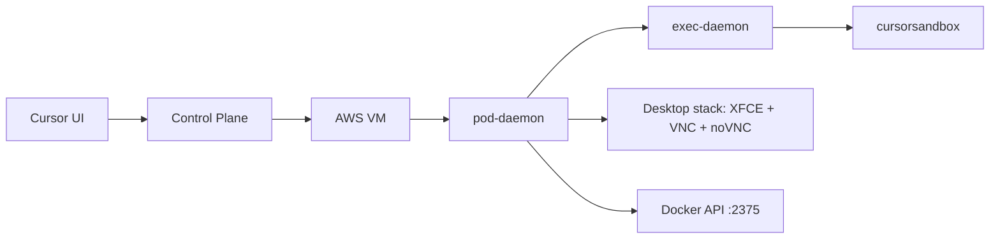

# Cursor Agent Architecture

## System Overview

Cursor Background Agent runs each task in an isolated cloud sandbox.



## Core Components

| Component | Role | Notes |
| --- | --- | --- |
| `pod-daemon` | Container lifecycle and process manager | gRPC control surface; runs as PID 1 |
| `exec-daemon` | Agent runtime/orchestration | PTY, file ops, tool execution, streaming |
| `cursorsandbox` | Policy enforcement layer | Filesystem/network/process restrictions |
| AnyOS desktop stack | GUI environment for computer-use flows | XFCE + TigerVNC + noVNC + Chrome |
| Docker-in-Docker access | Containerized workload support | Exposed via TCP `2375` in host mode |

## Runtime Ports

| Port | Service |
| --- | --- |
| `26053` | `agent.v1.ExecService` / `agent.v1.ControlService` |
| `26054` | `agent.v1.PtyHostService` |
| `26058` | noVNC web access |
| `5901` | TigerVNC |
| `26500` | pod-daemon gRPC |
| `50052` | additional internal gRPC surface |
| `2375` | Docker API |

## Execution Flow

1. Control plane schedules a task on a sandbox VM.
2. `pod-daemon` initializes runtime services.
3. `exec-daemon` receives task instructions and executes tools.
4. `cursorsandbox` applies command-level sandbox policy.
5. Desktop and Docker services are used as needed by the task.
6. Results stream back to Cursor UI.

## Repository Structure

| Path | Purpose |
| --- | --- |
| `docs/KEY_FINDINGS.md` | concise architecture findings |
| `docs/ARCHITECTURE_REFERENCE.md` | full deep-dive reference |
| `docs/SESSION_WAVE_NOTES.md` | raw wave-by-wave notes |
| `LATEST_FINDINGS.md` | generated findings snapshot |
| `scripts/refresh_findings.py` | regenerate `LATEST_FINDINGS.md` |
| `extracted/` | raw extracted evidence |

## Generate Snapshot

```bash
python3 scripts/refresh_findings.py
```
