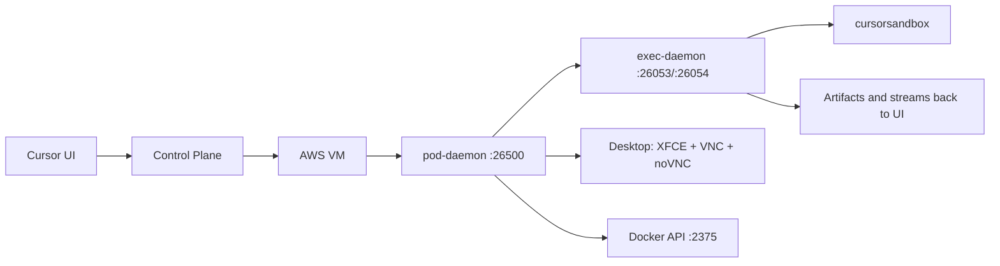

# Cursor Agent Architecture

Reverse-engineered architecture reference for Cursor Background Agent runtime.

## Index

- [Architecture Snapshot](#architecture-snapshot)
- [System Diagram](#system-diagram)
- [Component Index](#component-index)
- [Runtime Surface](#runtime-surface)
- [Security and Isolation Model](#security-and-isolation-model)
- [Evidence Sources](#evidence-sources)
- [Repository Map](#repository-map)
- [Deep-Dive Index](#deep-dive-index)
- [Regenerate Findings Snapshot](#regenerate-findings-snapshot)

## Architecture Snapshot

- Each task runs in an isolated cloud sandbox.
- Runtime control is split across `pod-daemon`, `exec-daemon`, and `cursorsandbox`.
- Sandbox environment includes desktop stack (`XFCE + TigerVNC + noVNC + Chrome`).
- Docker workloads are supported through exposed Docker API (`:2375`).
- Tooling and protocol surfaces are extracted and indexed under `extracted/`.
- Curated analysis lives in `docs/`, raw evidence remains in `extracted/`.

## System Diagram



## Component Index

| Component | Role | Primary Signals |
| --- | --- | --- |
| `pod-daemon` | Process/lifecycle manager | PID 1, gRPC control on `:26500` |
| `exec-daemon` | Agent orchestration runtime | tool execution, PTY host, streaming protocols |
| `cursorsandbox` | Command policy enforcement | filesystem/network/process restrictions |
| AnyOS desktop stack | GUI runtime for computer-use flows | XFCE, TigerVNC, noVNC, Chrome |
| Docker access layer | Run user containers/services | host-mode Docker API on `:2375` |

## Runtime Surface

### Network Ports

| Port | Service |
| --- | --- |
| `26053` | `agent.v1.ExecService`, `agent.v1.ControlService` |
| `26054` | `agent.v1.PtyHostService` |
| `26058` | noVNC web endpoint |
| `5901` | TigerVNC |
| `26500` | pod-daemon gRPC |
| `50052` | additional internal gRPC surface |
| `2375` | Docker API |

### Execution Flow

1. Control plane schedules sandbox task.
2. `pod-daemon` initializes runtime and supervises processes.
3. `exec-daemon` receives instructions and executes tools.
4. `cursorsandbox` applies command-level policy.
5. Desktop and Docker resources are used if required.
6. Output and artifacts stream back to client.

## Security and Isolation Model

| Layer | Notes |
| --- | --- |
| Runtime container mode | Host-network + privileged are observed in inspection snapshots |
| Command sandboxing | Enforced by `cursorsandbox` policy layer |
| Network controls | Proxy/policy enforcement signals present in extracted analysis |
| Metadata path | IMDS behavior captured in live probe notes |
| Artifact access | Hash-addressed S3 object behavior captured in evidence files |

## Evidence Sources

Primary machine-extracted sources:

- `extracted/exec-daemon-code/`
- `extracted/binary-analysis/`
- `extracted/system/`
- `extracted/docker-in-docker-inspection.json`
- `extracted/network-topology.txt`
- `extracted/s3-access-verdict.txt`
- `extracted/s3-probe-results.txt`

Curated summaries:

- [LATEST_FINDINGS.md](LATEST_FINDINGS.md)
- [docs/KEY_FINDINGS.md](docs/KEY_FINDINGS.md)
- [docs/ARCHITECTURE_REFERENCE.md](docs/ARCHITECTURE_REFERENCE.md)

## Repository Map

| Path | Purpose |
| --- | --- |
| `docs/KEY_FINDINGS.md` | concise architecture findings |
| `docs/ARCHITECTURE_REFERENCE.md` | full architecture deep dive |
| `docs/SESSION_WAVE_NOTES.md` | raw wave-by-wave notes appendix |
| `LATEST_FINDINGS.md` | generated findings snapshot |
| `scripts/refresh_findings.py` | regenerate findings snapshot |
| `scripts/fetch_and_refresh.sh` | fetch/pull + regenerate helper |
| `extracted/` | raw extracted evidence corpus |

## Deep-Dive Index

Main deep-dive document: [docs/ARCHITECTURE_REFERENCE.md](docs/ARCHITECTURE_REFERENCE.md)

Key sections:

- [Overview](docs/ARCHITECTURE_REFERENCE.md#overview)
- [Infrastructure Layers](docs/ARCHITECTURE_REFERENCE.md#infrastructure-layers)
- [Component Details](docs/ARCHITECTURE_REFERENCE.md#component-details)
- [Pod Daemon](docs/ARCHITECTURE_REFERENCE.md#1-pod-daemon)
- [Exec Daemon](docs/ARCHITECTURE_REFERENCE.md#2-exec-daemon)
- [Cursor Sandbox](docs/ARCHITECTURE_REFERENCE.md#3-cursor-sandbox)
- [AnyOS Desktop](docs/ARCHITECTURE_REFERENCE.md#4-anyos-desktop)
- [Docker-in-Docker](docs/ARCHITECTURE_REFERENCE.md#5-docker-in-docker)
- [Network Layout](docs/ARCHITECTURE_REFERENCE.md#network-layout)
- [Container Image](docs/ARCHITECTURE_REFERENCE.md#container-image)
- [How to Recreate](docs/ARCHITECTURE_REFERENCE.md#how-to-recreate)
- [gRPC API Schema](docs/ARCHITECTURE_REFERENCE.md#grpc-api-schema-the-control-plane-protocol)
- [Sandbox Policy System](docs/ARCHITECTURE_REFERENCE.md#sandbox-policy-system)
- [Security Analysis](docs/ARCHITECTURE_REFERENCE.md#security-analysis-live-sandbox-march-4-2026)
- [Live Sandbox Verification](docs/ARCHITECTURE_REFERENCE.md#live-sandbox-verification-march-4-2026)
- [Evidence Sources](docs/ARCHITECTURE_REFERENCE.md#evidence-sources)
- [Wave 9-14 Discoveries](docs/ARCHITECTURE_REFERENCE.md#wave-9-14-discoveries-session-2)

## Regenerate Findings Snapshot

```bash
python3 scripts/refresh_findings.py
```
