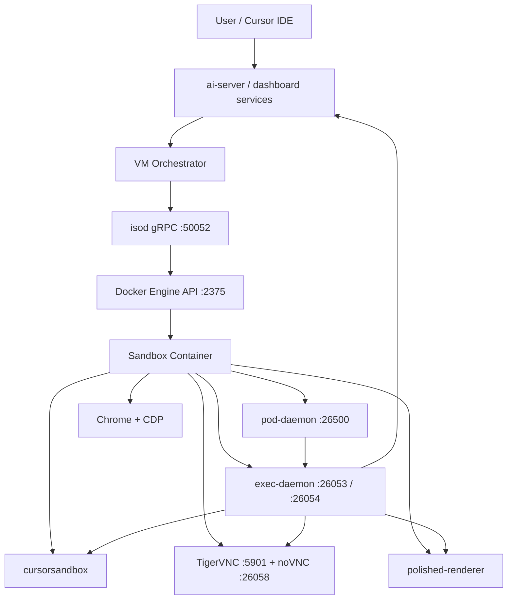
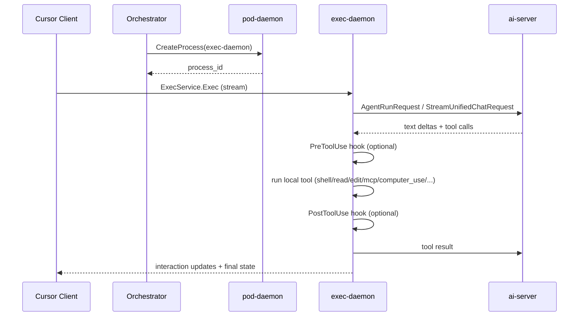
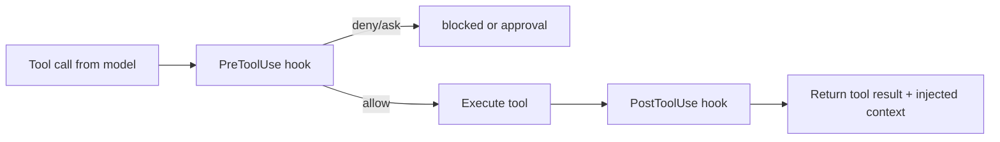
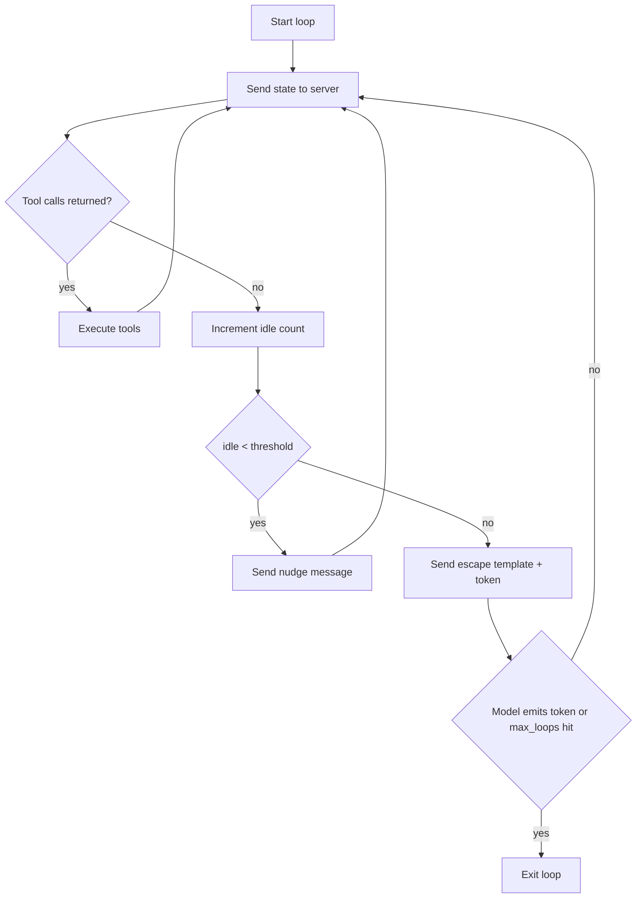

# Cursor Background Agent Architecture

Technical breakdown of Cursor's cloud/background agent runtime, based on captured runtime assets, protocol surfaces, and binary/runtime analysis.

## Index
- [What This Repo Covers](#what-this-repo-covers)
- [System Architecture](#system-architecture)
- [End-to-End Agent Flow](#end-to-end-agent-flow)
- [Core Components](#core-components)
- [Protocol Surface](#protocol-surface)
- [StreamUnifiedChatRequest (63 Fields)](#streamunifiedchatrequest-63-fields)
- [Tool Hooks + Continuation Loop](#tool-hooks--continuation-loop)
- [Transcript and Hydration Model](#transcript-and-hydration-model)
- [Computer-Use and Recording Implementation](#computer-use-and-recording-implementation)
- [Sandbox and Security Model](#sandbox-and-security-model)
- [Known Risks](#known-risks)
- [Repository Layout](#repository-layout)
- [Artifacts Map](#artifacts-map)

## What This Repo Covers
This repository documents the Cursor agent stack across four layers:

1. Host/container control plane (`isod`, Docker API, orchestrator-facing services).
2. In-container process plane (`pod-daemon`, `exec-daemon`, PTY and tool execution).
3. Desktop/computer-use plane (X11, VNC/noVNC, Chrome, screen capture/recording).
4. Policy/security plane (sandbox policy, network policy, command classification, secret redaction, hooks).

## System Architecture


## End-to-End Agent Flow


## Core Components
### 1) `isod` (host-side isolation daemon)
- Runs on port `50052` (`anyrun.v1.IsodService`).
- Manages container lifecycle: create/start/delete/pause/resume/snapshot/log attach/upload.
- Sits above Docker and below orchestrator.

### 2) `pod-daemon` (PID 1 in sandbox container)
- Runs on port `26500` (`anyrun.v1.PodDaemonService`).
- Primary RPCs: `CreateProcess`, `AttachProcess`.
- Spawns/attaches process streams for workloads including `exec-daemon`.

### 3) `exec-daemon` (agent runtime)
- Connect-RPC endpoints:
  - `26053` (`ExecService`, `ControlService`)
  - `26054` (`PtyHostService` over websocket)
- Executes local tool calls, builds request context, streams state to ai-server.

### 4) `cursorsandbox` (per-command isolation)
- Enforces filesystem/network policy for shell tool executions.
- Uses mount restrictions + Landlock + seccomp + optional HTTP proxy for egress controls.

### 5) Desktop runtime
- X11 + XFCE + TigerVNC + noVNC.
- Chrome configured for containerized software-rendering use.
- `polished-renderer` handles post-processed recording output.

## Protocol Surface
### Connect-RPC services (agent-side)
| Service | Port | Purpose |
| --- | --- | --- |
| `agent.v1.ExecService` | `26053` | Main streaming agent execution channel |
| `agent.v1.ControlService` | `26053` | Filesystem/artifact/env management RPCs |
| `agent.v1.PtyHostService` | `26054` | PTY lifecycle and terminal streaming |

### Exec protocol shape
`ExecServerMessage` / `ExecClientMessage` oneof payloads cover tools including:
- Files: read, write, edit, delete, list, glob, grep.
- Shell: command exec, stream, stdin writes, backgrounding.
- Context: request context extraction.
- MCP: list/read resources, tool calls, auth.
- Computer-use: actions + screen recording.
- Agent control: hooks, subagents, await, force background shell.

## StreamUnifiedChatRequest (63 Fields)
The main ai-server request message (`aiserver.v1.StreamUnifiedChatRequest`) contains 63 fields across these domains:

- Conversation state and summaries.
- Model routing + fallback controls.
- Unified mode selection (`CHAT`, `AGENT`, `EDIT`, `CUSTOM`, `PLAN`, `DEBUG`).
- Tool availability and MCP descriptors.
- File/editor/repository context.
- Indexing and semantic-search controls.
- Sandbox + approval/yolo flags.
- Encrypted context-bank and summarization cache keys.
- Planning and background execution metadata.
- Terminal/transcript folder wiring.

High-signal fields:
- `model_details`, `allow_model_fallbacks`, `thinking_level`.
- `supported_tools`, `mcp_tools`, `should_disable_tools`.
- `context_bank_session_id/context_bank_encryption_key`.
- `sandboxing_support_enabled`, `enable_yolo_mode`.
- `current_plan`, `agent_transcripts_folder`.

## Tool Hooks + Continuation Loop
### Pre/Post tool execution hooks
`PreToolUseRequestQuery` and `PostToolUseRequestQuery` allow external control around tool calls.

- Pre-hook can `allow`, `deny`, `ask`, and **rewrite tool input** (`updated_input`).
- Post-hook can inject `additional_context` back into the loop.



### Client-side continuation loop
The loop is driven in `exec-daemon` using `ClientContinuationConfig`:
- `idle_threshold`, `max_loops`.
- `nudge_message`.
- `escape_message_template` with random `{escape_token}`.
- Optional child collection (`collect_background_children`).



## Transcript and Hydration Model
Transcript layer includes:
- `HistoryVisibilityMode` (`INTERNAL` vs `EXTERNAL`).
- `TranscriptLoader` for recent listing + transcript retrieval.
- `hydrateMessages` flow that rebuilds state from:
  - archived summarized messages
  - root prompt tail
  - filtered system/summary segments

Content parts include text, reasoning, tool-call, tool-result, file/image markers.

## Computer-Use and Recording Implementation
`ComputerUseAction` supports 11 actions:
- mouse move/click/down/up/drag/scroll
- type/key/wait
- screenshot
- cursor position

Implementation details:
- Input actions via `xdotool` on X11 display.
- Screenshot pipeline via `ffmpeg x11grab` -> lossless WebP -> base64.
- API/display coordinate translation via scaler.
- Automatic final screenshot if no explicit screenshot action occurred.
- `RecordScreen` modes: start/save/discard.
- Event logger stores timestamped action completion events for replay alignment.

## Sandbox and Security Model
### Sandbox policy
`SandboxPolicy.Type`:
- `INSECURE_NONE`
- `WORKSPACE_READWRITE`
- `WORKSPACE_READONLY`

Merged policy sources:
1. per-user
2. per-repo
3. team-admin (highest priority)

### Network policy
`NetworkPolicy` supports allow/deny/default action + deny logging.
- `default_action`: `ALLOW` or `DENY`.
- `network_policy_strict` for fail-closed behavior.

### Command classifier
Gemini-based command classifier extracts executable commands and suggests sandbox mode:
- `SANDBOX`
- `NO_SANDBOX`
- `UNDETERMINED`

### Secret redaction
Secret redaction is applied to tool outputs (shell/read/grep/MCP).
Streaming path uses carry-buffer logic:
1. prepend carry + new chunk
2. hold potential secret-prefix tail
3. emit safe substring
4. flush carry on stream end

### Git hook secret scanner
Cloud-agent hook chain includes:
- pre-commit secret scanning against injected secret env values
- commit-msg secret scanning
- optional co-author append hook

## Known Risks
### Pod-daemon local privilege boundary
`pod-daemon` on `26500` is documented as unauthenticated in this extraction set; any process with local reachability may request privileged process creation. Treat as high-risk boundary unless protected by runtime isolation guarantees outside the container.

## Repository Layout
```text
.
├── README.md
├── ansible/                # Desktop/runtime provisioning playbook and packaged assets
├── artifacts/              # Consolidated protocol/runtime/security snapshots
│   ├── protocol/
│   ├── runtime/
│   ├── security/
│   └── ecr/
├── binary-analysis/        # Binary-level findings for sandbox/runtime daemons
├── computer-use-image/     # Standalone computer-use image boot scripts/config
├── config/                 # AnyOS display/theme/runtime config
├── exec-daemon-code/       # Deep protocol/tool/sandbox/internal docs
├── exec-daemon-meta/       # Runtime metadata and chunk artifacts
├── polished-renderer/      # Rust renderer source and mirrored package files
├── scripts/                # Canonical runtime shell scripts
├── system/                 # OS/package/env/docker snapshots
├── cursor-logos/           # Branding assets
└── xfce-config/            # Desktop config snapshots
```

## Artifacts Map
### Protocol and schema extracts
- `artifacts/protocol/*`
- `exec-daemon-code/protobuf-messages.txt`
- `exec-daemon-code/client-side-tools-v2*.txt`
- `exec-daemon-code/stream-unified-chat-request.txt`

### Runtime and topology extracts
- `artifacts/runtime/*`
- `binary-analysis/*`
- `system/*`

### Security and policy extracts
- `artifacts/security/*`
- `exec-daemon-code/sandbox-and-security-deep.txt`
- `exec-daemon-code/tool-execution-hooks.txt`
- `exec-daemon-code/secret-scanner-hooks.txt`

### Implementation deep dives
- `exec-daemon-code/computer-use-implementation.txt`
- `exec-daemon-code/diff-algorithm.txt`
- `exec-daemon-code/mcp-and-plugins.txt`
- `exec-daemon-code/prompt-construction.txt`
- `polished-renderer/polished-renderer/src/*`
